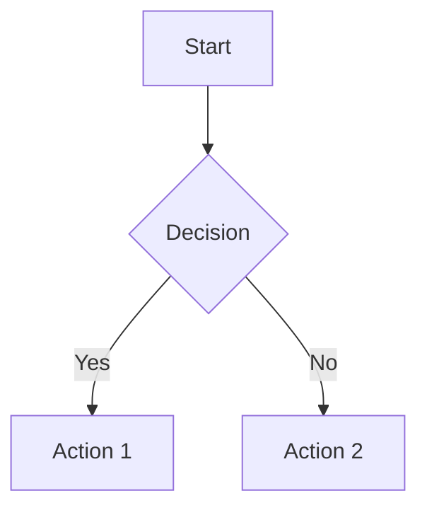
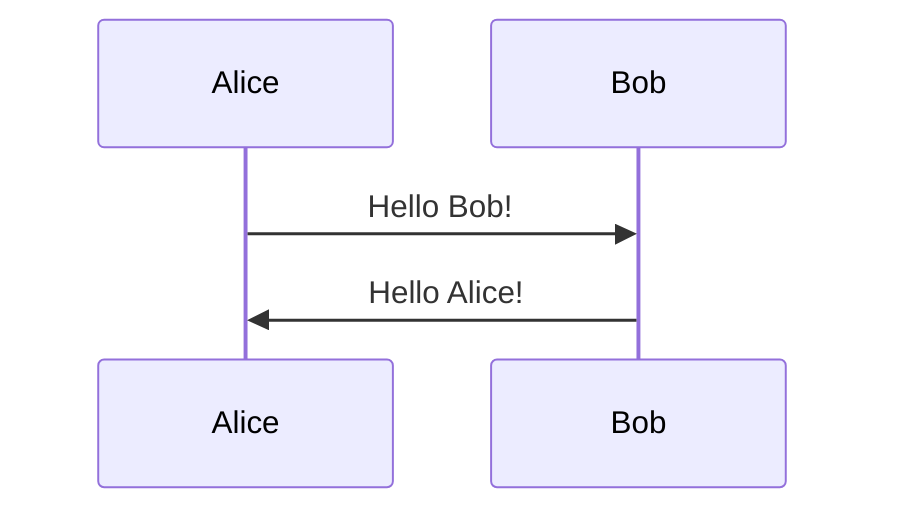
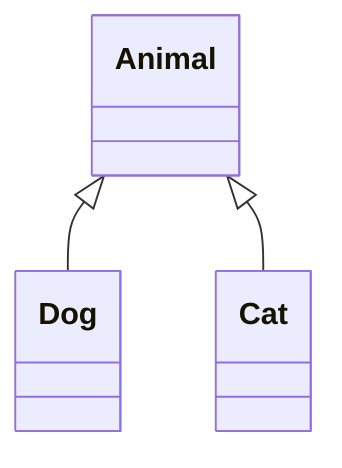

# Merview

[](https://www.gnu.org/licenses/agpl-3.0)
[](https://sonarcloud.io/summary/new_code?id=mickdarling_merview)
[](https://sonarcloud.io/summary/new_code?id=mickdarling_merview)
[](https://sonarcloud.io/summary/new_code?id=mickdarling_merview)
[](https://sonarcloud.io/summary/new_code?id=mickdarling_merview)

A client-side markdown editor with live Mermaid diagram rendering. No logins, no payments, completely free and open source.

## Features

- **Real-time Markdown rendering** - See your changes instantly
- **37 Professional Themes** - Beautiful styles from Marked2 collection (Academia default)
- **Mermaid diagram support** - Flowcharts, sequence diagrams, class diagrams, and more
- **PDF export** - Generate professional PDFs with one click
- **Drag and drop** - Drop .md files directly into the editor to load them
- **Auto-save** - Your work is automatically saved to browser localStorage
- **Clean interface** - Split-pane editor with syntax highlighting
- **Fast & lightweight** - Runs entirely in your browser
- **Privacy-focused** - Everything runs locally, no data sent anywhere

## Quick Start

### Option 1: Docker (Recommended)

**Using Docker Compose:**
```bash
docker-compose up -d
```

Then open http://localhost:8080 in your browser.

**Using Docker CLI:**
```bash
docker build -t merview:latest .
docker run -d -p 8080:80 --name merview merview:latest
```

**Using npm scripts:**
```bash
npm run docker:compose:up
# or
npm run docker:build && npm run docker:run
```

### Option 2: Open directly in browser

Simply open `index.html` in your web browser. That's it!

```bash
open index.html
```

### Option 3: Run with local server

```bash
npm install
npm start
```

This will start a local server at http://localhost:8080.

## Usage

1. **Edit** - Type or paste your Markdown in the left panel
2. **Choose a style** - Select from 37 professional themes in the dropdown
3. **Load files** - Drag and drop any .md file into the editor
4. **Preview** - See the rendered output in real-time on the right
5. **Export to PDF** - Click "Print/PDF" or use `Cmd/Ctrl + P`

### Keyboard Shortcuts

- `Cmd/Ctrl + S` - Show save status
- `Cmd/Ctrl + P` - Open print dialog (save as PDF)
- `Cmd/Ctrl + Shift + P` - Open in new tab for printing

## Mermaid Diagram Examples

### Flowchart



### Sequence Diagram



### Class Diagram



## Libraries Used

- [Marked.js](https://marked.js.org/) - Fast Markdown parser (MIT License)
- [Mermaid.js](https://mermaid.js.org/) - Diagram generation (MIT License)
- [CodeMirror](https://codemirror.net/) - Code editor (MIT License)
- [highlight.js](https://highlightjs.org/) - Syntax highlighting (BSD License)

## Browser Compatibility

Works in all modern browsers:
- Chrome/Edge (recommended)
- Firefox
- Safari
- Opera

## Docker Deployment

### Container Details

- **Base Image:** nginx:alpine (~25MB)
- **Port:** 80 (mapped to host port 8080)
- **Health Check:** Included
- **Auto-restart:** Enabled

### npm Scripts

```bash
npm run docker:compose:up      # Start with docker-compose
npm run docker:compose:down    # Stop container
npm run docker:build           # Build image
npm run docker:run             # Run container
npm run docker:stop            # Stop container
npm run docker:logs            # View logs
```

## License

This project is licensed under the [GNU Affero General Public License v3.0](LICENSE) (AGPL-3.0).

This means you're free to use, modify, and distribute this software, but if you run a modified version as a network service, you must make your source code available to users of that service.

See the [LICENSE](LICENSE) file for details.

## Contributing

Contributions are welcome! Feel free to fork and submit pull requests.
