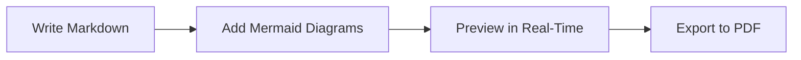
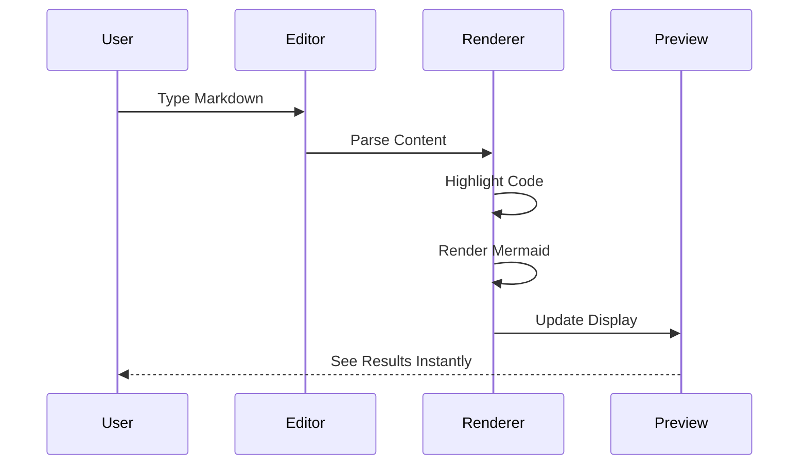

# About Merview

[← Back to Welcome](/?sample)

---

## What is Merview?

**Merview** is a client-side Markdown editor and previewer with first-class support for [Mermaid](https://mermaid.js.org/) diagrams. It's designed for developers, technical writers, and anyone who needs to create beautiful documentation with embedded diagrams.



## Key Features

### Privacy-First Design

Everything runs in your browser. Your documents never leave your machine unless you explicitly share them.

- **No server-side processing** - all rendering happens locally
- **No tracking or analytics** - we don't know what you write
- **No account required** - just open and start writing
- **Auto-save to localStorage** - your current work persists across browser sessions (note: loading a URL creates a new working copy; edits don't modify the original source)

### Mermaid Diagram Support

Full support for Mermaid.js diagrams including:

| Diagram Type | Description |
|--------------|-------------|
| Flowcharts | Process flows and decision trees |
| Sequence Diagrams | Interaction between components |
| Class Diagrams | Object-oriented design |
| State Diagrams | State machines and transitions |
| Entity Relationship | Database design |
| Gantt Charts | Project timelines |
| Pie Charts | Data visualization |
| Git Graphs | Branch and commit visualization |
| Mindmaps | Hierarchical brainstorming |
| Timeline | Chronological events |

### Professional Themes

Choose from **6 built-in styles** plus access to **40+ external themes** via the MarkedCustomStyles repository:

- **Clean** - Minimal and modern (default)
- **Academic** - Perfect for papers and reports
- **GitHub** - Familiar GitHub-flavored styling
- **Dark Mode** - Easy on the eyes
- **And many more via external styles...**

[View Theme Guide →](/?url=docs/themes.md)

### Code Syntax Highlighting

Beautiful syntax highlighting for **190+ programming languages** powered by highlight.js:

```javascript
// JavaScript example
const greet = (name) => `Hello, ${name}!`;
console.log(greet('World'));
```

```python
# Python example
def fibonacci(n):
    if n <= 1:
        return n
    return fibonacci(n-1) + fibonacci(n-2)
```

### Export Options

- **Save as PDF** - Export using your browser's print dialog (Cmd/Ctrl+P)

**Tips for better PDF exports:**
- Use the browser's print preview to adjust settings
- Reduce scale to ~75% to fit more content per page
- Disable headers/footers in print settings for cleaner output
- Content will automatically paginate across multiple pages

- **Save** - Download your document as a `.md` file

## How It Works



1. **Write** in the left pane using standard Markdown syntax
2. **Preview** updates in real-time in the right pane
3. **Style** your document using the theme selectors
4. **Export** when you're ready to share

## Technology

Merview is built with these open source libraries:

- **[marked](https://marked.js.org/)** - Fast Markdown parsing (MIT)
- **[highlight.js](https://highlightjs.org/)** - Syntax highlighting (BSD-3)
- **[Mermaid](https://mermaid.js.org/)** - Diagram rendering (MIT)
- **[CodeMirror](https://codemirror.net/)** - Editor component (MIT)
- **[DOMPurify](https://github.com/cure53/DOMPurify)** - XSS protection (Apache-2.0/MPL-2.0)

## Open Source

Merview is open source under the **AGPL-3.0 license**.

- **Source Code**: [github.com/mickdarling/merview](https://github.com/mickdarling/merview)
- **Report Issues**: [GitHub Issues](https://github.com/mickdarling/merview/issues)
- **Contribute**: [Contributing Guide](/?url=docs/contributing.md)

## Background

Merview was created by [Mick Darling](https://github.com/mickdarling) as a tool to help build [DollhouseMCP](https://github.com/mickdarling/DollhouseMCP), an MCP server for managing AI personas, skills, and templates. Writing documentation with embedded Mermaid diagrams needed a better workflow, and Merview was born.

It turned out to be a useful tool in its own right, so it's now available as a standalone project. It's maintained because it's genuinely useful—both for DollhouseMCP development and as a general-purpose Markdown+Mermaid editor.

---

## Navigation

- [← Back to Welcome](/?sample)
- [Developer Kit](/?url=docs/developer-kit.md)
- [Theme Guide](/?url=docs/themes.md)
- [Security](/?url=docs/security.md)
- [Contributing](/?url=docs/contributing.md)
- [Support the Project](/?url=docs/sponsor.md)
