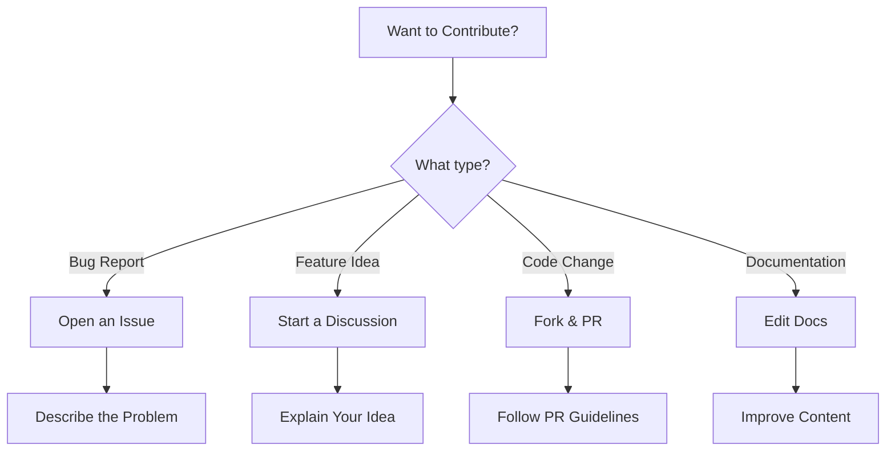
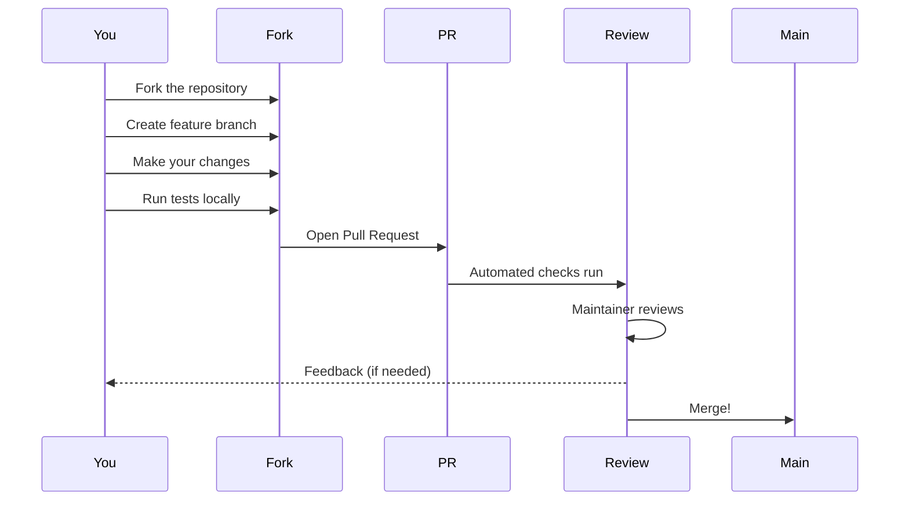

# Contributing to Merview

[← Back to Welcome](/?sample)

---

Thank you for your interest in contributing to Merview! This document will help you get started.



---

## Ways to Contribute

### Report Bugs

Found something broken? [Open an issue](https://github.com/mickdarling/merview/issues/new?template=bug_report.md) with:

- **What happened** - Clear description of the bug
- **What you expected** - How it should have worked
- **Steps to reproduce** - How we can see the bug
- **Environment** - Browser, OS, etc.

### Suggest Features

Have an idea? [Open a feature request](https://github.com/mickdarling/merview/issues/new?template=feature_request.md) with:

- **The problem** - What need does this address?
- **Your solution** - How would it work?
- **Alternatives** - Other approaches you considered

### Submit Code

Ready to code? Here's the process:



---

## Development Setup

### Prerequisites

- A modern web browser
- Git
- Node.js 18+ (only needed for running tests)

### Getting Started

```bash
# Clone your fork
git clone https://github.com/YOUR_USERNAME/merview.git
cd merview

# Start a local server - no build step needed!
# Use any static file server, for example:
npx http-server -p 8080
# or: python3 -m http.server 8080

# Open http://localhost:8080 in your browser
```

**Note:** Merview is a vanilla JavaScript application with no build step. All libraries are loaded from CDNs. You can open `index.html` directly in a browser, but a local server is recommended for testing URL loading features.

**Doc Navigation:** Links to documentation pages (like `/?url=docs/about.md`) automatically resolve to your local server in development or to GitHub raw content in production. The app detects `localhost` or `127.0.0.1` and adjusts URLs accordingly, so you can test doc navigation locally without changing any paths.

### Running Tests (Optional)

Tests use Playwright and require Node.js:

```bash
# Install test dependencies
npm install

# Run all tests
npm test

# Run specific test file
npx playwright test tests/your-test.spec.js
```

### Project Structure

```
merview/
├── index.html          # Main application
├── js/                 # JavaScript modules
│   ├── main.js         # Application entry point
│   ├── file-ops.js     # File operations
│   ├── render.js       # Markdown rendering
│   └── ...
├── tests/              # Playwright tests
├── docs/               # Documentation
└── worker/             # Cloudflare Worker (proxy)
```

---

## Code Guidelines

### JavaScript

- Use ES6+ features (modules, arrow functions, etc.)
- No build step required - vanilla JS only
- Follow existing code style
- Add JSDoc comments for public functions

### Testing

- Write Playwright tests for new features
- Ensure existing tests pass: `npm test`
- Test across browsers when possible

### Commits

We use conventional commit messages:

```
feat: Add new diagram type support
fix: Correct theme loading issue
docs: Update contributing guide
test: Add edge case coverage
chore: Update dependencies
```

---

## Pull Request Process

1. **Create a branch** from `main`:
   ```bash
   git checkout -b feature/your-feature-name
   ```

2. **Make your changes** with clear, focused commits

3. **Run tests** to ensure nothing broke:
   ```bash
   npm test
   ```

4. **Push** to your fork:
   ```bash
   git push origin feature/your-feature-name
   ```

5. **Open a PR** with:
   - Clear title describing the change
   - Description of what and why
   - Reference to related issues (`Fixes #123`)

6. **Respond to feedback** - we may suggest changes

7. **Celebrate** when it's merged! 🎉

---

## Code of Conduct

- Be respectful and inclusive
- Focus on constructive feedback
- Help others learn and grow
- Assume good intentions

---

## Questions?

- **GitHub Issues**: [github.com/mickdarling/merview/issues](https://github.com/mickdarling/merview/issues)
- **Discussions**: [github.com/mickdarling/merview/discussions](https://github.com/mickdarling/merview/discussions)

---

## Navigation

- [← Back to Welcome](/?sample)
- [About Merview](/?url=docs/about.md)
- [Developer Kit](/?url=docs/developer-kit.md)
- [Theme Guide](/?url=docs/themes.md)
- [Security](/?url=docs/security.md)
- [Support the Project](/?url=docs/sponsor.md)
