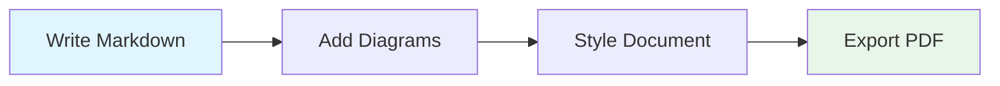

# Merview Features Demo

## Mermaid Diagrams



## Code Syntax Highlighting

```javascript
// Real-time rendering with 190+ languages
const render = async (markdown) => {
  const html = await marked.parse(markdown);
  preview.innerHTML = html;
  await mermaid.run();
};
```

## 37 Professional Themes

Choose from Academia, GitHub, Swiss, Amblin, and many more elegant styles.
