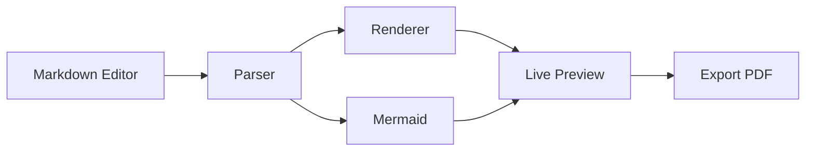

# Merview Demo

A markdown editor with live preview and Mermaid diagram support.

## Code Example

```javascript
function greet(name) {
  return `Hello, ${name}!`;
}

const message = greet('World');
console.log(message);
```

## Architecture Diagram



## Features

- **Real-time preview** - See changes instantly
- **Syntax highlighting** - Code blocks with colors
- **Mermaid diagrams** - Flowcharts, sequences, and more
- **No login required** - Just start typing
