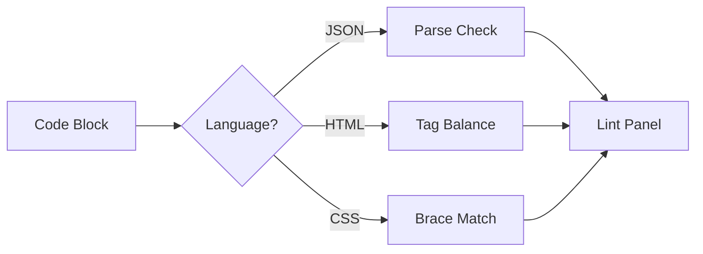

# Code Validation Demo

[← Back to Welcome](/?sample) | [About](/?url=docs/about.md)

---

This page demonstrates Merview's built-in code validation feature. Toggle the **Lint** button in the toolbar to see validation results.



---

## How It Works

1. Click the **Lint** button in the toolbar to enable validation
2. The lint panel appears at the bottom of the preview
3. Issues are shown with type (error/warning), language, and block number

---

## Valid Code Examples

These code blocks should pass validation with no errors:

### Valid JSON

```json
{
  "name": "Merview",
  "version": "1.0.0",
  "features": ["markdown", "mermaid", "themes"],
  "config": {
    "autoSave": true,
    "lintEnabled": false
  }
}
```

### Valid HTML

```html
<!DOCTYPE html>
<html lang="en">
<head>
    <meta charset="UTF-8">
    <title>Example</title>
</head>
<body>
    <h1>Hello World</h1>
    <p>This is valid HTML.</p>
</body>
</html>
```

### Valid CSS

```css
.container {
    display: flex;
    justify-content: center;
    align-items: center;
}

.button {
    background: #3498db;
    color: white;
    padding: 10px 20px;
    border-radius: 4px;
}
```

---

## Invalid Code Examples

> **Note:** The code blocks below contain **intentional errors** for demonstration purposes. Enable the Lint panel to see how Merview detects these issues.

These code blocks contain errors that the linter will detect:

### Invalid JSON - Missing Comma

```json
{
  "name": "Merview"
  "version": "1.0.0"
}
```

**Expected Error:** JSON syntax error - missing comma between properties

### Invalid JSON - Trailing Comma

```json
{
  "name": "Merview",
  "version": "1.0.0",
}
```

**Expected Error:** JSON syntax error - trailing comma not allowed

### Invalid JSON - Unquoted Key

```json
{
  name: "Merview",
  version: "1.0.0"
}
```

**Expected Error:** JSON syntax error - keys must be quoted

### Invalid HTML - Unclosed Tags

```html
<div>
    <p>This paragraph is not closed
    <span>Neither is this span
</div>
```

**Expected Warning:** Possible unclosed HTML tags

### Invalid HTML - Missing DOCTYPE

```html
<html>
<head>
    <title>No DOCTYPE</title>
</head>
<body>
    <p>This HTML document is missing DOCTYPE declaration.</p>
</body>
</html>
```

**Expected Warning:** Missing DOCTYPE declaration

### Invalid CSS - Mismatched Braces

```css
.container {
    display: flex;
    justify-content: center;

.button {
    background: blue;
}
```

**Expected Error:** Mismatched braces - opening brace without closing

### Invalid CSS - Extra Closing Brace

```css
.container {
    display: flex;
}}

.button {
    color: white;
}
```

**Expected Error:** Mismatched braces - extra closing brace

---

## Languages Not Yet Validated

JavaScript and Python require parser libraries for safe syntax validation. These languages show syntax highlighting only (for now):

### JavaScript (No Validation Yet)

```javascript
// This has a syntax error but won't be flagged
const x = {
    name: 'test'
    // missing comma
    value: 42
};
```

### Python (No Validation Yet)

```python
# Python is highlighted but not validated
def example():
    print("Hello"  # Missing closing parenthesis
```

### Other Languages

YAML, Bash, SQL, and other languages are syntax-highlighted but not validated.

> **Coming in v1.1:** Full syntax validation for JavaScript (via Acorn), Python, YAML, and more. See [issue #198](https://github.com/mickdarling/merview/issues/198) for details.

---

## Tips

1. **Enable Validation** - Click the Lint button to toggle the panel
2. **Real-time Updates** - The panel updates as you edit
3. **Block Numbers** - Issues reference the code block number (1, 2, 3...)
4. **Types** - Errors are critical issues, Warnings are suggestions

---

## Navigation

- [← Back to Welcome](/?sample)
- [International Text Demo](/?url=docs/demos/international-text.md)
- [YAML Front Matter Demo](/?url=docs/demos/yaml-front-matter.md)
- [Error Handling Demo](/?url=docs/demos/error-handling.md)

---

*Found an issue with this demo? [Report it on GitHub](https://github.com/mickdarling/merview/issues/new)*
