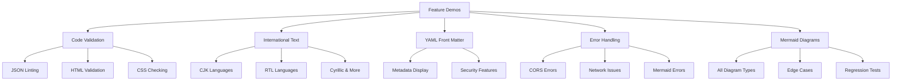

# Feature Demos

[← Back to Welcome](/?sample) | [About](/?url=docs/about.md)

---

Explore Merview's features through interactive demonstrations. Each page showcases a specific capability with live examples.

---

## Available Demos

### Code Validation

**[View Demo →](/?url=docs/demos/code-validation.md)**

Learn how Merview validates your code blocks in real-time:
- JSON syntax parsing
- HTML tag balance checking
- CSS brace matching
- Examples of valid and invalid code

---

### International Language Support

**[View Demo →](/?url=docs/demos/international-text.md)**

See how Merview handles text from around the world:
- Chinese, Japanese, Korean (CJK)
- Arabic and Hebrew (RTL)
- Russian, Ukrainian (Cyrillic)
- Greek, Thai, Hindi, and more

---

### YAML Front Matter

**[View Demo →](/?url=docs/demos/yaml-front-matter.md)**

Discover how to add metadata to your documents:
- Document title, author, date
- Tags and categories
- Version information
- Security features

---

### Error Handling

**[View Demo →](/?url=docs/demos/error-handling.md)**

Understand how Merview handles problems gracefully:
- CORS error explanations
- Network error recovery
- Content type validation
- Mermaid syntax errors

---

### Mermaid Diagram Test Suite

**[View Demo →](/?url=docs/demos/mermaid-diagrams.md)**

Comprehensive test page for all Mermaid diagram types:
- Flowcharts, sequence, class, state, ER diagrams
- Gantt, pie, quadrant, git graph, mindmaps
- Timeline, sankey, XY charts, block diagrams
- Edge cases: labels, clickable nodes, special characters

---

## Quick Links

| Demo | Focus | Key Features |
|------|-------|--------------|
| [Code Validation](/?url=docs/demos/code-validation.md) | Developer Tools | Lint panel, real-time validation |
| [International Text](/?url=docs/demos/international-text.md) | Unicode Support | CJK, RTL, Cyrillic scripts |
| [YAML Front Matter](/?url=docs/demos/yaml-front-matter.md) | Document Metadata | Collapsible panel, security |
| [Error Handling](/?url=docs/demos/error-handling.md) | Troubleshooting | CORS, timeouts, validation |
| [Mermaid Diagrams](/?url=docs/demos/mermaid-diagrams.md) | Regression Testing | All diagram types, edge cases |

---

## More Resources

- [About Merview](/?url=docs/about.md) - Full feature overview
- [Developer Kit](/?url=docs/developer-kit.md) - Integration guide
- [Theme Guide](/?url=docs/themes.md) - Styling options
- [Security](/?url=docs/security.md) - Privacy and protection

---

## Navigation

- [← Back to Welcome](/?sample)
- [About Merview](/?url=docs/about.md)
- [Developer Kit](/?url=docs/developer-kit.md)

---

*Found an issue with these demos? [Report it on GitHub](https://github.com/mickdarling/merview/issues/new)*
