# Mermaid Diagram Test Suite

[← Back to Demos](/?url=docs/demos/index.md) | [Welcome](/?sample)

---

A comprehensive test page covering all Mermaid diagram types and edge cases. Use this for regression testing after renderer changes.

## Quick Navigation

- [Flowcharts](#flowcharts)
- [Sequence Diagrams](#sequence-diagrams)
- [Class Diagrams](#class-diagrams)
- [State Diagrams](#state-diagrams)
- [Entity Relationship](#entity-relationship-diagrams)
- [User Journey](#user-journey)
- [Gantt Charts](#gantt-charts)
- [Pie Charts](#pie-charts)
- [Quadrant Charts](#quadrant-chart)
- [Git Graph](#git-graph)
- [Mindmaps](#mindmaps)
- [Timeline](#timeline)
- [Sankey](#sankey-diagram)
- [XY Charts](#xy-chart)
- [Block Diagrams](#block-diagrams)
- [Edge Cases](#edge-cases)

---

## Flowcharts

### Basic Flowchart (LR)

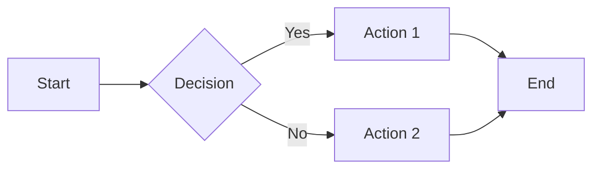

### Flowchart with Subgraphs

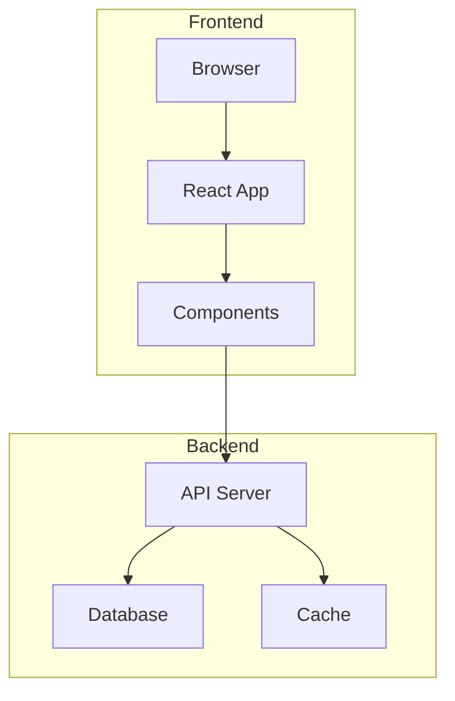

### Clickable Flowchart

Click on any node to navigate:

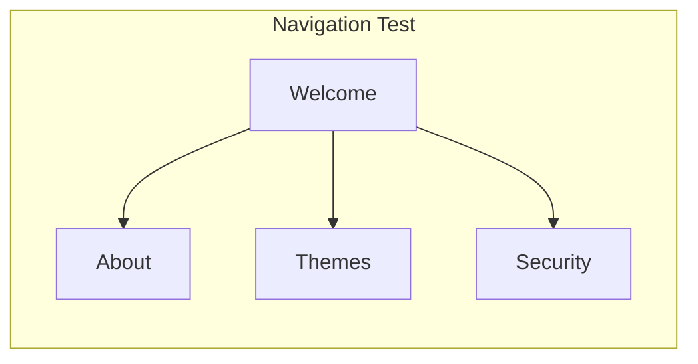

### Edge Labels (Critical for Issue #327)

This tests the foreignObject rendering with edge labels:

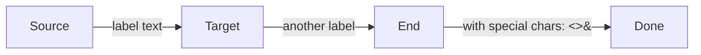

### Complex Edge Labels

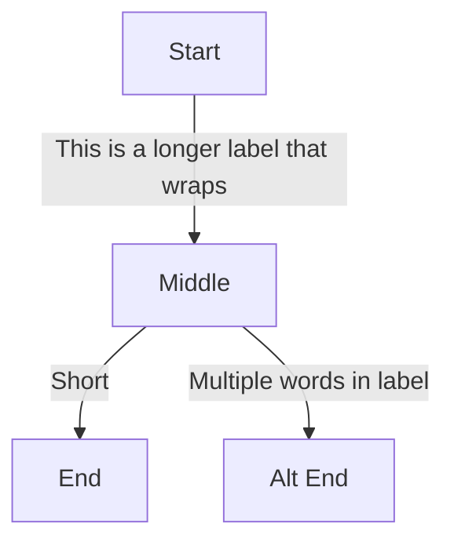

### All Node Shapes

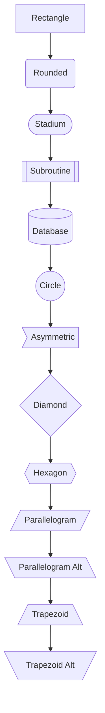

### Styled Flowchart

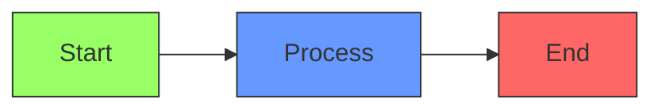

---

## Sequence Diagrams

### Basic Sequence

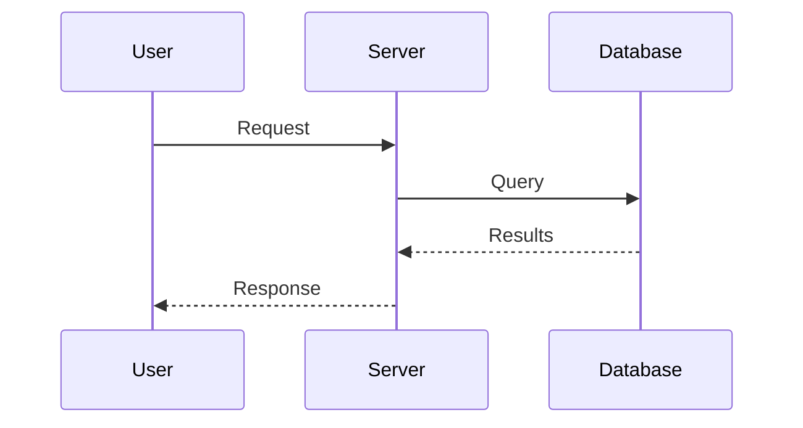

### With Activations and Notes

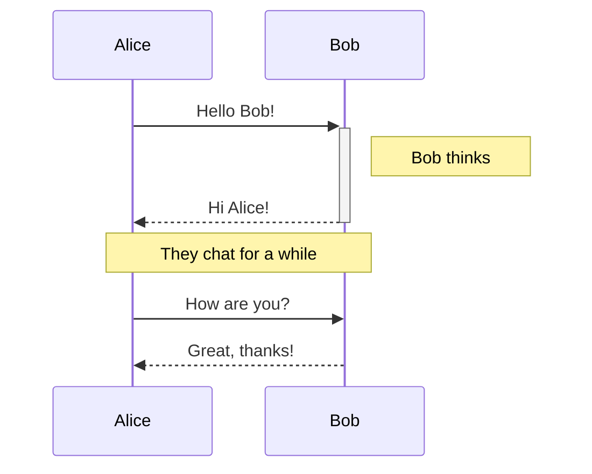

### Loops and Alt

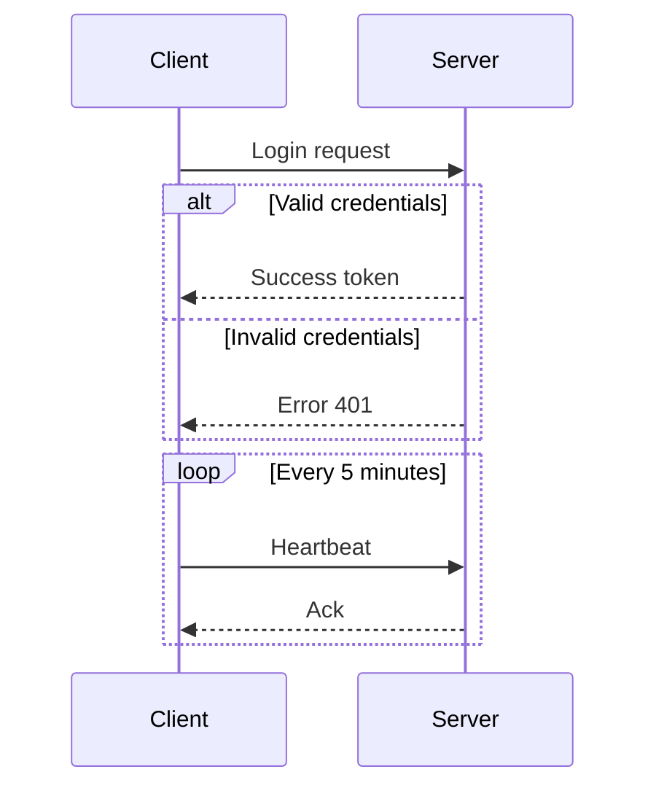

### Complex Sequence with Multiple Features

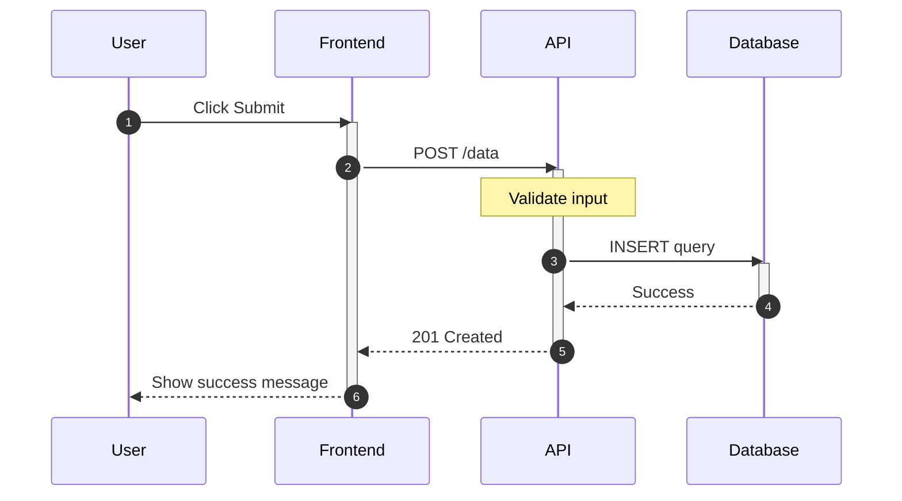

---

## Class Diagrams

### Basic Class Diagram

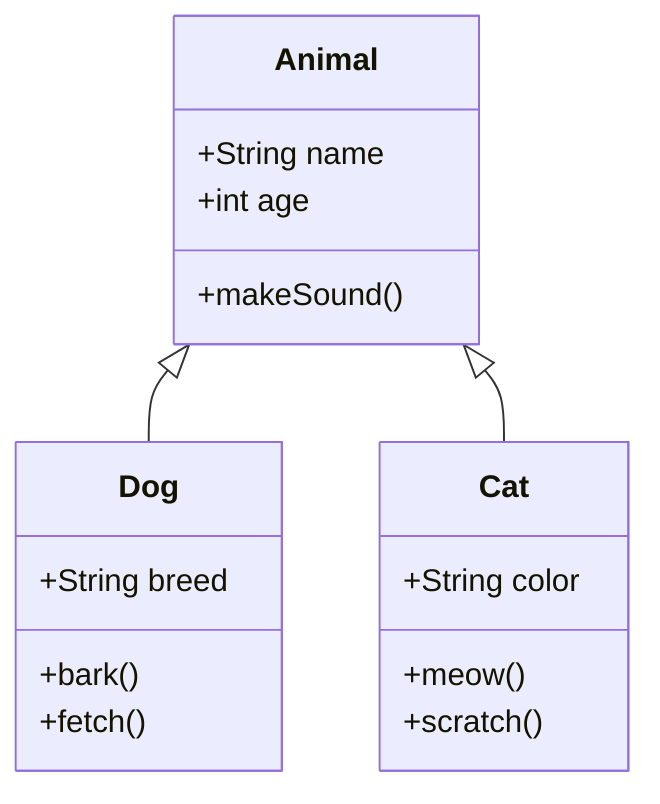

### With Relationships

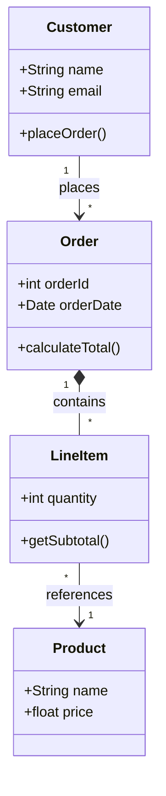

### Interfaces and Abstract Classes

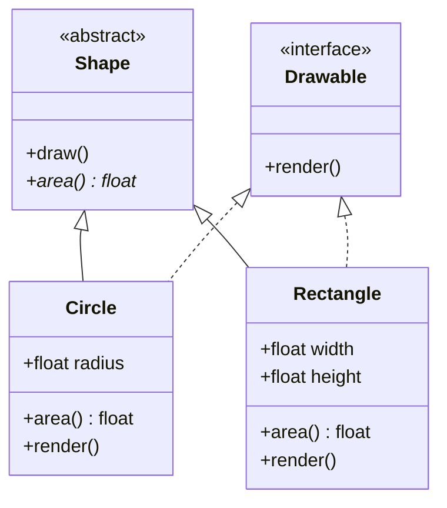

---

## State Diagrams

### Basic State Machine

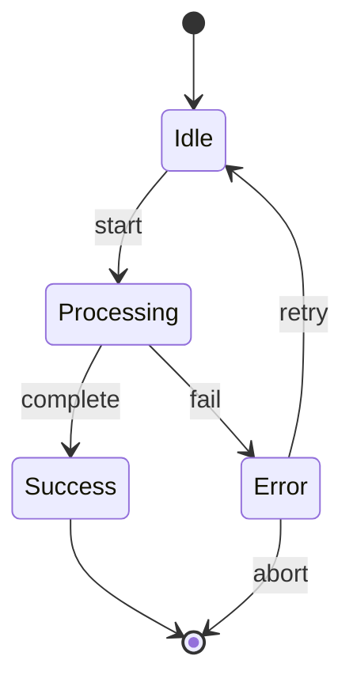

### Composite States

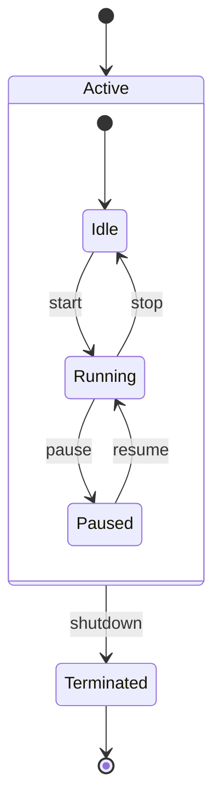

### With Notes and Forks

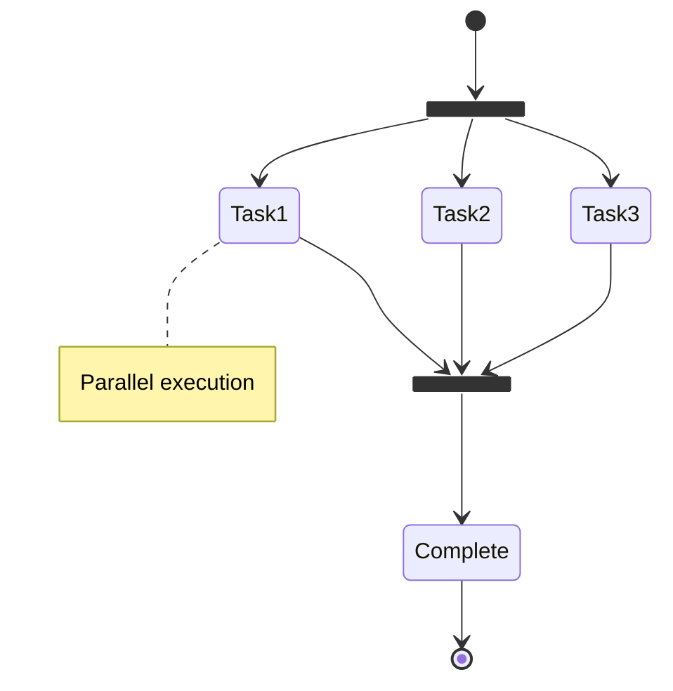

---

## Entity Relationship Diagrams

### Basic ER Diagram

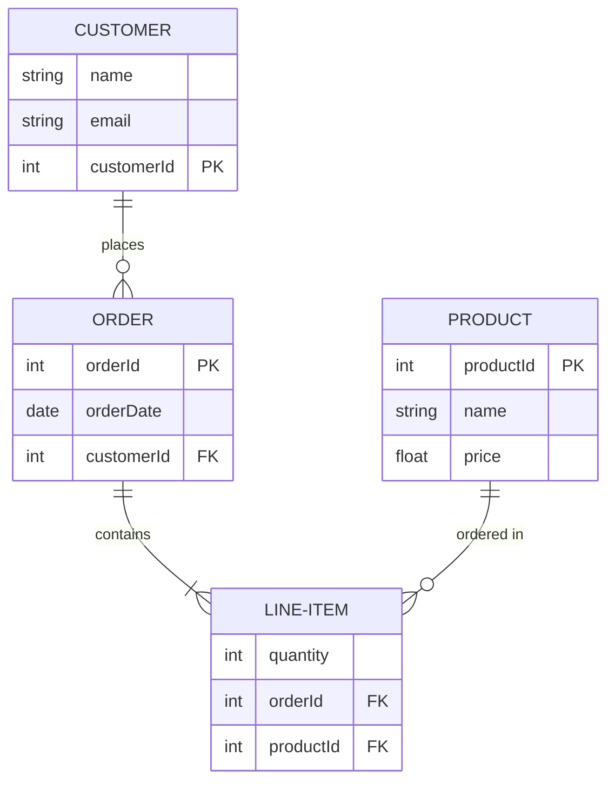

### Complex ER Diagram

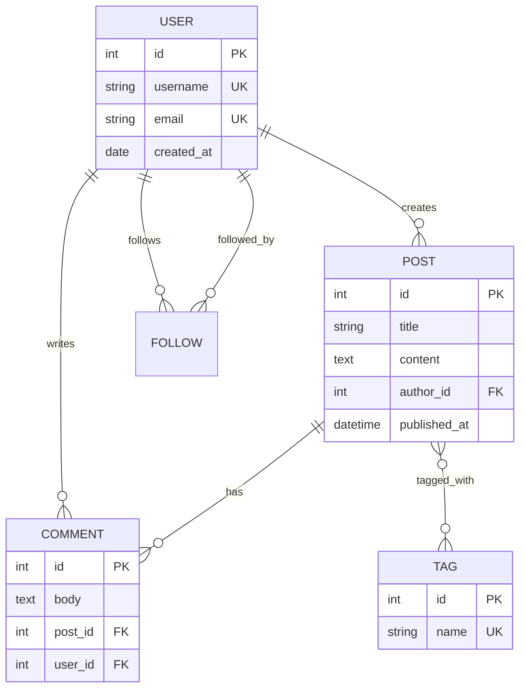

---

## User Journey

### Basic User Journey

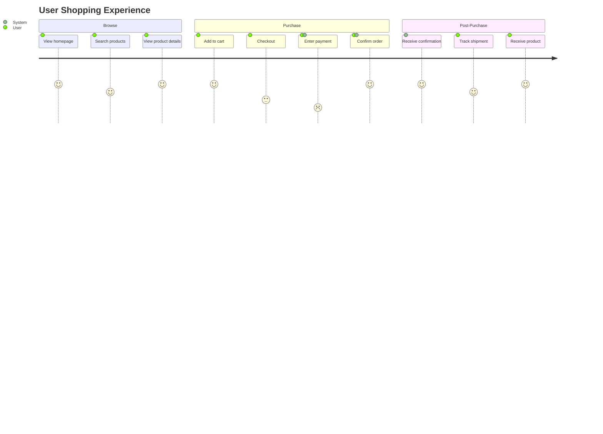

---

## Gantt Charts

### Project Timeline

```mermaid
gantt
    title Project Development Schedule
    dateFormat  YYYY-MM-DD

    section Planning
    Requirements gathering    :a1, 2024-01-01, 14d
    Design phase             :a2, after a1, 21d

    section Development
    Frontend development     :b1, after a2, 30d
    Backend development      :b2, after a2, 35d
    Integration              :b3, after b1, 14d

    section Testing
    Unit testing             :c1, after b2, 14d
    Integration testing      :c2, after b3, 10d
    UAT                      :c3, after c2, 7d

    section Deployment
    Production release       :d1, after c3, 3d
```

### With Milestones

```mermaid
gantt
    title Sprint Planning
    dateFormat YYYY-MM-DD

    section Sprint 1
    Feature A          :done, a1, 2024-01-01, 5d
    Feature B          :active, a2, after a1, 7d
    Sprint 1 Review    :milestone, m1, after a2, 0d

    section Sprint 2
    Feature C          :crit, b1, after m1, 10d
    Feature D          :b2, after m1, 8d
    Sprint 2 Review    :milestone, m2, after b1, 0d
```

---

## Pie Charts

### Basic Pie Chart

```mermaid
pie title Browser Market Share
    "Chrome" : 65
    "Safari" : 19
    "Firefox" : 8
    "Edge" : 5
    "Other" : 3
```

### Development Time Distribution

```mermaid
pie showData
    title Time Spent on Project
    "Coding" : 45
    "Testing" : 25
    "Documentation" : 15
    "Meetings" : 10
    "Review" : 5
```

---

## Quadrant Chart

### Priority Matrix

```mermaid
quadrantChart
    title Feature Priority Matrix
    x-axis Low Effort --> High Effort
    y-axis Low Impact --> High Impact
    quadrant-1 Plan
    quadrant-2 Do First
    quadrant-3 Delegate
    quadrant-4 Eliminate

    Feature A: [0.2, 0.8]
    Feature B: [0.7, 0.9]
    Feature C: [0.3, 0.3]
    Feature D: [0.8, 0.2]
    Feature E: [0.5, 0.6]
```

---

## Git Graph

### Basic Git Flow

```mermaid
gitGraph
    commit id: "Initial"
    branch develop
    checkout develop
    commit id: "Dev work"
    branch feature
    checkout feature
    commit id: "Feature 1"
    commit id: "Feature 2"
    checkout develop
    merge feature
    checkout main
    merge develop tag: "v1.0"
    commit id: "Hotfix"
```

### Complex Git History

```mermaid
gitGraph
    commit id: "init"
    branch develop
    commit id: "setup"
    branch feature-a
    commit id: "feat-a-1"
    commit id: "feat-a-2"
    checkout develop
    branch feature-b
    commit id: "feat-b-1"
    checkout feature-a
    commit id: "feat-a-3"
    checkout develop
    merge feature-a
    checkout feature-b
    commit id: "feat-b-2"
    checkout develop
    merge feature-b
    checkout main
    merge develop tag: "v1.0.0"
```

---

## Mindmaps

### Project Overview

```mermaid
mindmap
    root((Merview))
        Features
            Markdown
                GFM Support
                Tables
                Code Blocks
            Mermaid
                All Diagram Types
                Live Preview
                Theme Support
            Export
                PDF
                Print
        Technology
            Frontend
                Vanilla JS
                CodeMirror
                marked.js
            Security
                DOMPurify
                CSP
                No Backend
        Design
            Themes
                37 Styles
                Code Themes
                Mermaid Themes
```

---

## Timeline

### Project History

```mermaid
timeline
    title Merview Development Timeline

    2024-Q1 : Initial concept
            : Basic markdown rendering

    2024-Q2 : Mermaid integration
            : Multiple themes
            : Code validation

    2024-Q3 : Security hardening
            : XSS prevention
            : CSP implementation

    2024-Q4 : Performance optimization
            : International text support
            : Documentation
```

---

## Sankey Diagram

### Energy Flow

```mermaid
sankey-beta

Source A,Process 1,100
Source A,Process 2,50
Source B,Process 1,30
Source B,Process 3,70
Process 1,Output X,80
Process 1,Output Y,50
Process 2,Output X,30
Process 2,Output Z,20
Process 3,Output Y,40
Process 3,Output Z,30
```

---

## XY Chart

### Line Chart

```mermaid
xychart-beta
    title "Sales Performance"
    x-axis [Jan, Feb, Mar, Apr, May, Jun]
    y-axis "Revenue (K)" 0 --> 100
    line [30, 45, 60, 55, 70, 85]
    bar [25, 40, 55, 50, 65, 80]
```

---

## Block Diagrams

### System Architecture

```mermaid
block-beta
    columns 3

    block:client:1
        columns 1
        Browser
        Mobile
    end

    space

    block:server:1
        columns 1
        API
        DB[(Database)]
    end

    client --> server
```

---

## Edge Cases

### Special Characters in Labels

Testing proper escaping and rendering:

```mermaid
graph LR
    A["Quotes: 'single' and \"double\""] --> B["Angle brackets: <html>"]
    B --> C["Ampersand: A & B"]
    C --> D["Unicode: 日本語 中文"]
```

### Very Long Labels

```mermaid
graph TD
    A["This is a very long label that should wrap properly and not break the layout of the diagram"] --> B["Short"]
    B --> C["Another extremely long label to test how the rendering engine handles overflow and text wrapping in foreignObject elements"]
```

### Empty and Minimal Diagrams

```mermaid
graph LR
    A --> B
```

### Deeply Nested Subgraphs

```mermaid
graph TD
    subgraph Level1[Level 1]
        subgraph Level2[Level 2]
            subgraph Level3[Level 3]
                A[Deep Node]
            end
            B[L2 Node]
        end
        C[L1 Node]
    end
    D[Root] --> Level1
    A --> B
    B --> C
```

### Multiple Edge Labels on Same Connection

```mermaid
graph LR
    A[Source] -->|"Label 1"| B[Middle]
    A -->|"Label 2"| B
    B -->|"Output"| C[End]
```

### Styling with Classes and IDs

```mermaid
graph TD
    A[Node A]:::classA --> B[Node B]:::classB
    B --> C[Node C]:::classC

    classDef classA fill:#ff9,stroke:#333,stroke-width:2px
    classDef classB fill:#9ff,stroke:#333,stroke-width:2px
    classDef classC fill:#f9f,stroke:#333,stroke-width:2px
```

### Links with Different Arrow Types

```mermaid
graph LR
    A --> B
    B --- C
    C -.-> D
    D ==> E
    E --o F
    F --x G
    G <--> H
    H o--o I
    I x--x J
```

---

## Regression Test Checklist

Use this checklist when testing after renderer changes:

| Test | Expected Result |
|------|-----------------|
| Edge labels visible | Labels should have background color |
| Clickable nodes work | Clicking navigates to target URL |
| Style tags preserved | CSS classes apply correctly |
| foreignObject intact | HTML content renders in labels |
| Subgraphs render | Nested groups display properly |
| Special chars escape | No XSS, chars display correctly |
| All diagram types work | No render errors in console |

---

## Navigation

- [← Back to Demos](/?url=docs/demos/index.md)
- [Welcome](/?sample)
- [About](/?url=docs/about.md)

---

*Last updated: December 2024 | Tests Mermaid v11.x rendering*
