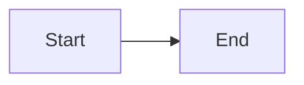
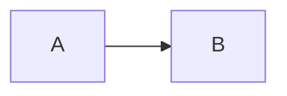
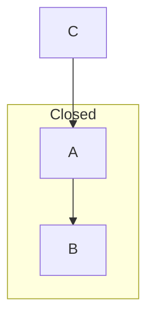
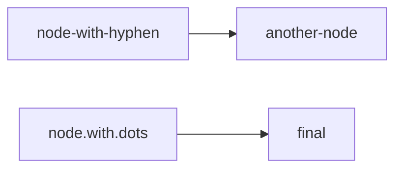
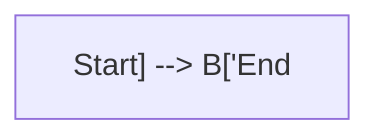
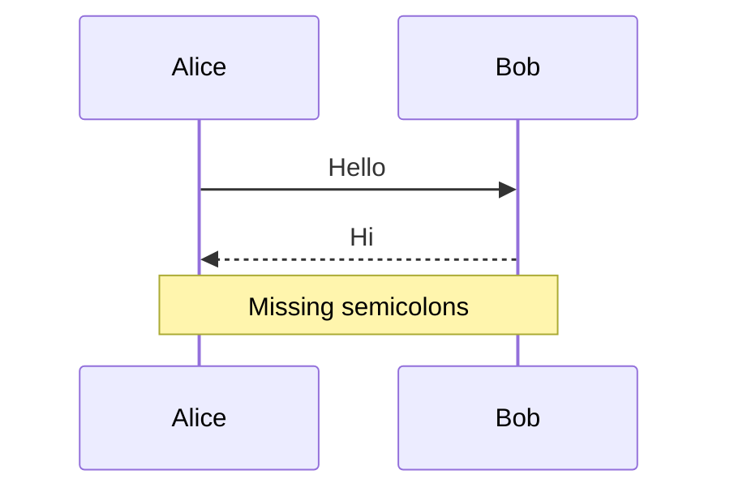
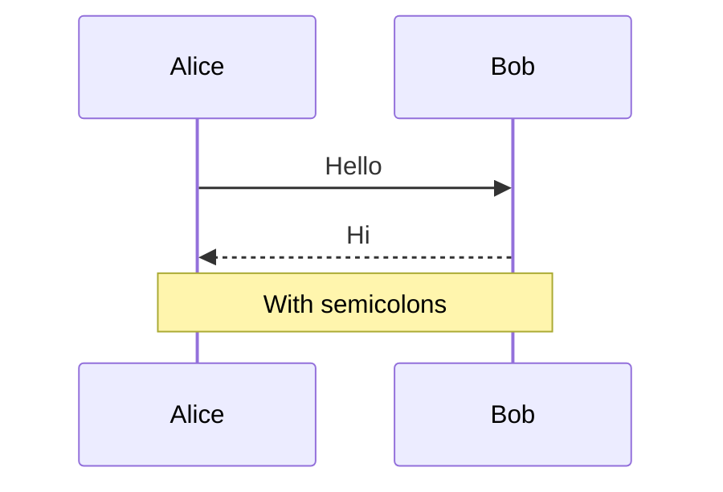

# Mermaid Error Examples

[← Back to Demos](/?url=docs/demos/index.md) | [Welcome](/?sample) | [Mermaid Test Suite](/?url=docs/demos/mermaid-diagrams.md)

---

This page demonstrates how Merview handles **intentionally malformed** Mermaid diagrams. These examples show common syntax errors and how the renderer recovers gracefully without breaking the page.

## Purpose

Understanding Mermaid error handling helps you:
- **Debug syntax errors** in your own diagrams
- **Learn common mistakes** and how to fix them
- **Verify renderer stability** when processing invalid syntax
- **Test error recovery** in your integration

> **Note:** All errors on this page are **intentional**. Each broken diagram is followed by its corrected version for comparison.

---

## Quick Navigation

- [Missing Arrow Syntax](#missing-arrow-syntax)
- [Invalid Diagram Type](#invalid-diagram-type)
- [Unclosed Subgraph](#unclosed-subgraph)
- [Common Error Patterns](#common-error-patterns)
- [Debugging Tips](#debugging-tips)

---

## Missing Arrow Syntax

### Error Example

**Problem:** Missing arrow operator between nodes.

```mermaid
graph LR
    A[Start]
    B[End]
    A B
```

> **Expected Result:** The diagram above should display an error message or fail to render. This is a syntax error because `A B` is not valid Mermaid syntax.

### Corrected Version

**Solution:** Add the arrow operator `-->` between nodes.



**What went wrong:** Mermaid requires explicit arrow operators (`-->`, `---`, `-.->`, etc.) to define connections between nodes. Simply placing two nodes next to each other doesn't create a connection.

**Common variations of this error:**
- `A B C` (multiple nodes without arrows)
- `Start End` (plain text without brackets or arrows)
- `A[Node] B[Node]` (nodes with labels but no arrow)

---

## Invalid Diagram Type

### Error Example

**Problem:** Using a non-existent diagram type.

```mermaid
invalidtype
    A --> B
```

> **Expected Result:** Mermaid should display an error message indicating an unknown diagram type.

### Corrected Version

**Solution:** Use a valid diagram type like `graph`, `sequenceDiagram`, `classDiagram`, etc.



**What went wrong:** Mermaid only recognizes specific diagram type keywords. `invalidtype` is not a valid Mermaid diagram type.

**Valid diagram types include:**
- `graph` or `flowchart` - Flowcharts
- `sequenceDiagram` - Sequence diagrams
- `classDiagram` - Class diagrams
- `stateDiagram` or `stateDiagram-v2` - State diagrams
- `erDiagram` - Entity relationship diagrams
- `journey` - User journey diagrams
- `gantt` - Gantt charts
- `pie` - Pie charts
- `gitGraph` - Git graphs
- `mindmap` - Mind maps
- `timeline` - Timelines
- `quadrantChart` - Quadrant charts
- `sankey-beta` - Sankey diagrams
- `xychart-beta` - XY charts
- `block-beta` - Block diagrams

---

## Unclosed Subgraph

### Error Example

**Problem:** Subgraph opened but never closed with `end`.

```mermaid
graph TD
    subgraph Unclosed
        A --> B
```

> **Expected Result:** This should produce a parse error because the subgraph is not properly closed.

### Corrected Version

**Solution:** Close the subgraph with the `end` keyword.



**What went wrong:** Every `subgraph` declaration must be closed with an `end` keyword. Forgetting to close subgraphs is a common error that breaks the parser.

**Related errors:**
- Multiple nested subgraphs missing `end` statements
- Mismatched `end` statements (closing in wrong order)
- Forgetting `end` after conditional blocks in sequence diagrams

---

## Common Error Patterns

### Unmatched Brackets

**Error:** Missing closing bracket on node label.

```mermaid
graph LR
    A[Start --> B[End]
```

**Fix:** Ensure all brackets are properly closed.


---

### Invalid Characters in Node IDs

**Error:** Using special characters in node IDs without quotes.



This may work in some Mermaid versions but fail in others. Better to use quotes or underscores.

**Fix:** Use camelCase, underscores, or quotes for node IDs.


---

### Mismatched Quote Types

**Error:** Mixing single and double quotes or forgetting closing quotes.



**Fix:** Use matching quote types and close all quotes.


---

### Missing Semicolons in Sequence Diagrams

**Error:** Some Mermaid versions are strict about semicolons.



This usually works, but if you encounter errors:

**Fix:** Add semicolons after each line (optional in newer versions).



---

## Debugging Tips

### 1. Check the Console

Browser console errors provide detailed information about syntax errors:

```
Parse error on line 3:
...graph TD    subgraph Unclosed
----------------------^
Expecting 'end', got 'EOF'
```

### 2. Use Online Mermaid Editor

Test your diagrams in the [Mermaid Live Editor](https://mermaid.live/) to isolate syntax issues.

### 3. Validate Diagram Type

Ensure you're using the correct diagram type keyword:
- ✗ `graph TD` for sequence diagrams
- ✓ `sequenceDiagram` for sequence diagrams

### 4. Check Bracket Matching

Use an editor with bracket matching to ensure all `[`, `{`, `(`, `"`, and `'` characters are properly closed.

### 5. Simplify and Rebuild

If a complex diagram fails:
1. Start with the simplest version that works
2. Add elements one at a time
3. Identify which addition breaks the syntax

### 6. Review Mermaid Version

Different Mermaid versions support different syntax:
- Merview currently uses Mermaid 11.12.2
- Some beta features use different syntax (`block-beta`, `sankey-beta`, etc.)
- Check [Mermaid documentation](https://mermaid.js.org/) for version-specific syntax

---

## Error Recovery Behavior

Merview handles Mermaid errors gracefully:

1. **Error Display:** Malformed diagrams show error messages in place of the diagram
2. **Continued Rendering:** Valid diagrams after errors still render correctly
3. **Page Stability:** Syntax errors don't break the entire page
4. **Console Logging:** Detailed errors are logged to browser console for debugging

### Testing Error Recovery

This page includes multiple intentional errors. Notice that:
- Each error is contained to its own diagram block
- Valid diagrams throughout the page still render correctly
- The page remains interactive and functional
- Navigation links continue to work

---

## Expected Behavior

When you encounter a Mermaid error in Merview:

| Behavior | What Happens | User Action |
|----------|-------------|-------------|
| Error Display | Red error box or message appears | Check console for details |
| Valid Diagrams | Continue to render normally | No action needed |
| Page Function | Remains fully interactive | Can edit and retry |
| Console Output | Shows specific syntax error | Use for debugging |

---

## See Also

- [Mermaid Diagram Test Suite](/?url=docs/demos/mermaid-diagrams.md) - Complete test coverage with all valid diagram types
- [Error Handling Demo](/?url=docs/demos/error-handling.md) - General error handling in Merview
- [Mermaid Documentation](https://mermaid.js.org/) - Official syntax reference

---

## Navigation

- [← Back to Demos](/?url=docs/demos/index.md)
- [Mermaid Test Suite](/?url=docs/demos/mermaid-diagrams.md)
- [Welcome](/?sample)
- [About](/?url=docs/about.md)

---

*Last updated: December 2024 | Tests Mermaid v11.x error handling*
