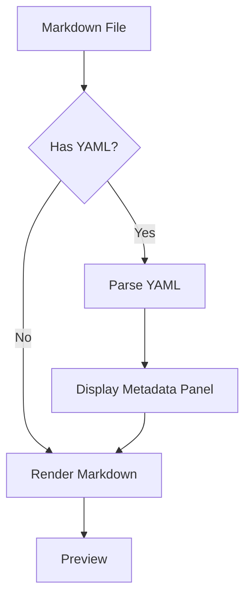

# YAML Front Matter Demo

[← Back to Welcome](/?sample) | [About](/?url=docs/about.md)

---

This page demonstrates Merview's YAML front matter support. Notice the collapsible metadata panel at the top of this preview - that's rendered from the YAML block at the start of this document.



---

## What is YAML Front Matter?

YAML front matter is a block of metadata at the very beginning of a markdown file, delimited by triple dashes (`---`). It's commonly used for:

- Document metadata (title, author, date)
- Configuration settings
- Tags and categories
- Version information
- Custom properties

---

## How It Works in Merview

1. Add YAML between `---` delimiters at the start of your document
2. Merview parses the YAML and displays it as a collapsible panel
3. Click the panel to expand/collapse the metadata table
4. The rest of your markdown renders normally below

---

## Supported YAML Features

### Simple Key-Value Pairs

```yaml
---
title: My Document
author: Your Name
date: 2025-12-13
---
```

### Arrays (Lists)

```yaml
---
tags:
  - markdown
  - documentation
  - tutorial
---
```

### Nested Values

```yaml
---
author:
  name: John Doe
  email: john@example.com
---
```

**Note:** Merview uses a simple YAML parser focused on security. Complex nested structures and advanced YAML features are intentionally limited.

---

## Security Features

Merview's YAML parser is hardened against attacks:

| Protection | Description |
|------------|-------------|
| No Code Execution | YAML is parsed as data only |
| Anchor/Alias Blocking | `&` and `*` patterns rejected |
| Custom Tag Blocking | `!` patterns rejected |
| Size Limits | Max 100 keys, 500 array items |
| Value Truncation | Values over 10,000 chars truncated |
| XSS Protection | All values HTML-escaped |

---

## Example Use Cases

### Academic Paper

```yaml
---
title: Analysis of Machine Learning Algorithms
author: Dr. Jane Smith
institution: MIT
date: 2025-12-13
doi: 10.1234/example.2025.001
keywords:
  - machine learning
  - algorithms
  - neural networks
abstract: This paper presents...
---
```

### Technical Documentation

```yaml
---
title: API Reference
version: 2.1.0
last_updated: 2025-12-13
status: stable
deprecated: false
breaking_changes: none
---
```

### Blog Post

```yaml
---
title: Getting Started with Merview
author: Mick Darling
published: 2025-12-13
category: tutorials
tags:
  - markdown
  - mermaid
  - editors
featured_image: /images/merview-hero.png
reading_time: 5 minutes
---
```

### Project README

```yaml
---
project: Merview
version: 1.0.0
license: AGPL-3.0
homepage: https://merview.com
repository: https://github.com/mickdarling/merview
maintainers:
  - Mick Darling
---
```

---

## What's NOT Supported

For security reasons, these YAML features are blocked:

### Anchors and Aliases

```yaml
---
# This will be skipped
base: &base
  name: default
derived:
  <<: *base
---
```

### Custom Tags

```yaml
---
# This will be skipped
date: !timestamp 2025-12-13
data: !!binary R0lGODlhAQABAIAAAP///wAAACH5BAEAAAAAL
---
```

---

## Rendering Notes

### Multi-line Strings

Multi-line strings may not render as expected due to how whitespace is handled:

```yaml
---
description: |
  This is a long
  multi-line description
  that spans several lines.
---
```

---

## Tips

1. **Keep It Simple** - Use basic key-value pairs for best results
2. **Click to Expand** - The metadata panel is collapsible
3. **Arrays Work** - Lists display as bullet points
4. **Safe by Default** - All values are sanitized

---

## Try It Yourself

Create a new document and add YAML front matter at the very beginning:

```markdown
---
title: My First Document
author: Your Name
date: 2025-12-13
tags:
  - test
  - example
---

# My Document

Start writing your content here...
```

---

## Navigation

- [← Back to Welcome](/?sample)
- [Code Validation Demo](/?url=docs/demos/code-validation.md)
- [International Text Demo](/?url=docs/demos/international-text.md)
- [Error Handling Demo](/?url=docs/demos/error-handling.md)

---

*Found an issue with this demo? [Report it on GitHub](https://github.com/mickdarling/merview/issues/new)*
