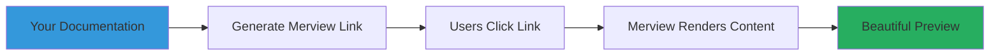
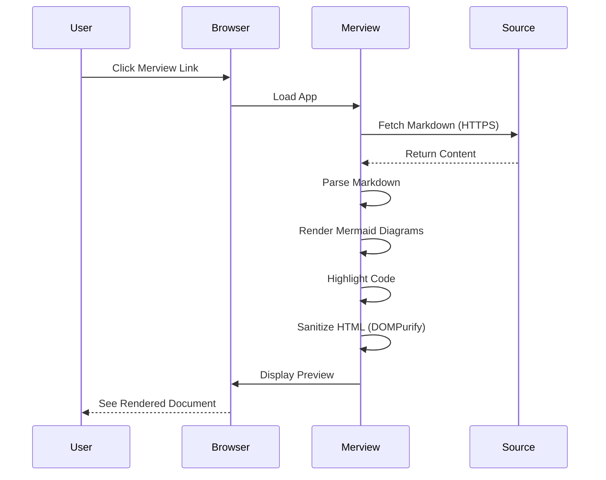
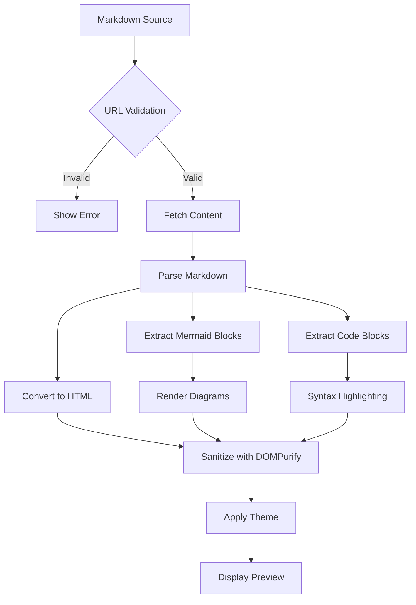
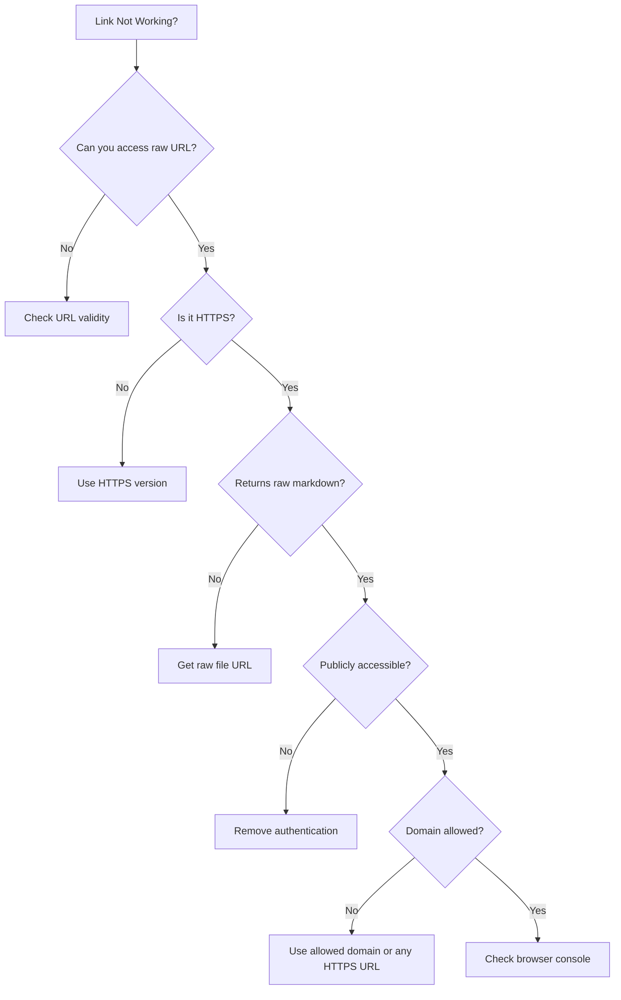

# Developer Kit

[Back to Welcome](/?sample)

---

Welcome to the Merview Developer Kit. This guide helps you integrate Merview into your documentation workflow, create shareable links, and understand how to leverage Merview as a rendering endpoint for markdown content.



---

## What is Merview?

Merview is a client-side markdown and Mermaid diagram renderer. It runs entirely in the browser with no server-side processing, making it perfect for:

- Quick markdown previews
- Documentation rendering
- Diagram visualization
- Shareable markdown links
- Educational content display

---

## URL-Based Document Loading

### The `?url=` Parameter

Merview can load and render any publicly accessible markdown file via the `?url=` parameter:

```
https://your-merview-instance.com/?url=YOUR_MARKDOWN_URL
```

### Requirements

1. **HTTPS Only** - URLs must use HTTPS protocol
2. **Public Access** - Content must be publicly accessible (no authentication)
3. **CORS-Friendly** - Server should allow cross-origin requests
4. **Raw Content** - URL should point to raw markdown (not HTML wrapper)

### Security Note

Merview only allows content from trusted domains for security:
- `raw.githubusercontent.com` - GitHub raw files
- `gist.githubusercontent.com` - GitHub Gists
- `cdn.jsdelivr.net` - jsDelivr CDN
- `unpkg.com` - unpkg CDN
- `cdnjs.cloudflare.com` - Cloudflare CDN

**As of PR #202**, Merview supports loading from ANY HTTPS URL, not just the allowlisted domains above. Content is sanitized with DOMPurify for XSS protection.

---

## Creating Shareable Links

### GitHub Files

For GitHub repository files:

1. Navigate to your markdown file on GitHub
2. Click the "Raw" button
3. Copy the raw URL (starts with `raw.githubusercontent.com`)
4. Construct your Merview link:

```
https://your-merview-instance.com/?url=https://raw.githubusercontent.com/user/repo/main/README.md
```

**Example:**
```
https://your-merview-instance.com/?url=https://raw.githubusercontent.com/mickdarling/merview/main/README.md
```

### GitHub Gists

For Gist files:

1. Create or open a Gist
2. Click the "Raw" button on the file
3. Copy the raw URL
4. Construct your Merview link:

```
https://your-merview-instance.com/?url=https://gist.githubusercontent.com/user/gist-id/raw/file.md
```

### CDN-Hosted Files

If you host markdown on a CDN:

```
https://your-merview-instance.com/?url=https://cdn.jsdelivr.net/gh/user/repo@version/file.md
```

---

## Integration Examples

### HTML Link Button

Add a "View in Merview" button to your documentation:

```html
<a href="https://your-merview-instance.com/?url=https://raw.githubusercontent.com/user/repo/main/docs/guide.md"
   target="_blank"
   rel="noopener noreferrer">
    View in Merview
</a>
```

### Markdown Badge/Link

Create a clickable badge in your README:

```markdown
[](https://your-merview-instance.com/?url=https://raw.githubusercontent.com/user/repo/main/README.md)
```

### JavaScript Function

Generate Merview links programmatically:

```javascript
/**
 * Generate a Merview link for a markdown file
 * @param {string} rawUrl - Raw markdown file URL
 * @returns {string} Merview preview URL
 */
function generateMerviewLink(rawUrl) {
    const baseUrl = 'https://your-merview-instance.com/';
    const params = new URLSearchParams({ url: rawUrl });
    return `${baseUrl}?${params.toString()}`;
}

// Example usage
const readmeUrl = 'https://raw.githubusercontent.com/user/repo/main/README.md';
const merviewLink = generateMerviewLink(readmeUrl);
console.log(merviewLink);
// Output: https://your-merview-instance.com/?url=https%3A%2F%2Fraw.githubusercontent.com%2Fuser%2Frepo%2Fmain%2FREADME.md
```

### Python Script

Generate links from a script:

```python
from urllib.parse import urlencode

def generate_merview_link(raw_url):
    """Generate a Merview link for a markdown file"""
    base_url = 'https://your-merview-instance.com/'
    params = urlencode({'url': raw_url})
    return f'{base_url}?{params}'

# Example usage
readme_url = 'https://raw.githubusercontent.com/user/repo/main/README.md'
merview_link = generate_merview_link(readme_url)
print(merview_link)
```

---

## Use Cases

### 1. Documentation Sites

Add "Preview" links to your documentation:

```markdown
## API Reference

[View API Docs](docs/api.md) | [Preview in Merview](https://your-merview-instance.com/?url=https://raw.githubusercontent.com/user/repo/main/docs/api.md)
```

### 2. GitHub Issues/PRs

Share rendered versions of documentation changes:

```markdown
I've updated the guide. Preview the changes here:
https://your-merview-instance.com/?url=https://raw.githubusercontent.com/user/repo/feature-branch/GUIDE.md
```

### 3. Email/Chat Links

Share formatted documentation in team chats or emails without requiring recipients to clone repositories or install tools.

### 4. Education & Training

Create shareable links to course materials, tutorials, and guides that render beautifully with diagrams.

### 5. Blog Posts

Embed markdown content in blog posts or articles with a "view rendered" link.

---

## Architecture Overview

How Merview processes your content:



### Processing Pipeline



---

## URL Encoding

### When to URL Encode

Always URL-encode the markdown URL when constructing Merview links:

```javascript
// Wrong - special characters can break the URL
const link = `https://your-merview-instance.com/?url=https://example.com/path with spaces/file.md`;

// Correct - URL encoded
const encodedUrl = encodeURIComponent('https://example.com/path with spaces/file.md');
const link = `https://your-merview-instance.com/?url=${encodedUrl}`;
```

### Common Encoding Issues

| Character | Unencoded | Encoded |
|-----------|-----------|---------|
| Space | ` ` | `%20` |
| `?` | `?` | `%3F` |
| `&` | `&` | `%26` |
| `=` | `=` | `%3D` |
| `/` | `/` | `%2F` (in query params) |

### Manual Construction

Most languages provide URL encoding utilities:

```javascript
// JavaScript
const url = encodeURIComponent(rawUrl);
```

```python
# Python
from urllib.parse import quote
url = quote(raw_url, safe='')
```

```bash
# Shell (jq)
echo "https://example.com/file.md" | jq -sRr @uri
```

---

## Error Handling

### What Happens When URLs Fail?

Merview displays user-friendly error messages:

- **Invalid Domain**: "URL domain not allowed for security"
- **Network Error**: "Failed to load content from URL"
- **Invalid Content**: "Content type not allowed"
- **CORS Error**: "Cross-origin request blocked"

### Testing Links

Before sharing Merview links:

1. Test the raw URL directly in your browser
2. Verify it returns raw markdown (not HTML)
3. Check there are no authentication requirements
4. Confirm the URL is publicly accessible

### Debugging Tips

If a Merview link doesn't work:



---

## Best Practices

### 1. Use Version Tags

For stable links, reference specific versions or tags:

```
# Bad - points to moving target
?url=https://raw.githubusercontent.com/user/repo/main/docs.md

# Good - points to specific version
?url=https://raw.githubusercontent.com/user/repo/v1.2.0/docs.md
```

### 2. Keep URLs Short

Long URLs can be unwieldy. Consider:
- Using git.io or other URL shorteners
- Hosting on CDNs with shorter paths
- Using GitHub Gists for standalone documents

### 3. Test with Different Themes

Merview offers 37+ themes. Test your content with:
- Light themes (Clean, Academic)
- Dark themes (Dark, Nord)
- Specialized themes (GitHub, Markdown)

Ensure your content looks good across themes.

### 4. Optimize Diagrams

Large Mermaid diagrams may not render well:
- Keep diagrams focused and concise
- Use subgraphs for organization
- Consider splitting complex diagrams
- Test on mobile viewports

### 5. Document Your Links

When sharing Merview links, explain what they are:

```markdown
## Documentation

View the [User Guide](https://your-merview-instance.com/?url=...)
(rendered version via Merview)
```

---

## Security Considerations

### Content Sanitization

All rendered HTML is sanitized with [DOMPurify](https://github.com/cure53/DOMPurify):
- Scripts are stripped
- Dangerous attributes removed
- Only safe HTML elements allowed

### HTTPS Requirement

Merview requires HTTPS for:
- Protecting content in transit
- Preventing man-in-the-middle attacks
- Ensuring content integrity

### Private Content Warning

If you accidentally paste a URL with authentication tokens, Merview will:
1. Detect the token pattern
2. Show a warning modal
3. Require explicit confirmation
4. Suggest secure alternatives (Gist sharing)

### No Server Logging

Merview is client-side only:
- No server processing
- No URL logging
- No content storage
- No analytics (currently)

---

## Advanced Features

### Custom Themes

Users can select from 37+ built-in themes or load external styles. Your documentation will adapt to their chosen theme automatically.

### Mermaid Interactivity

Mermaid diagrams in Merview support:
- Click events (if defined in diagram)
- Fullscreen view (double-click)
- Zoom controls
- Pan and drag

### Code Validation

Merview includes optional code validation for:
- YAML syntax checking
- JSON structure validation
- Markdown linting

### Export to PDF

Users can export your documentation to PDF with:
- All diagrams rendered
- Syntax highlighting preserved
- Custom styling applied

---

## API Reference

While Merview doesn't have a formal API, you can construct URLs programmatically:

### URL Structure

```
https://your-merview-instance.com/[?parameter]
```

### Parameters

| Parameter | Type | Description | Example |
|-----------|------|-------------|---------|
| `url` | string | HTTPS URL to markdown file | `?url=https://raw.githubusercontent.com/...` |
| `sample` | flag | Load welcome document | `?sample` |

### Future Parameters (Not Yet Implemented)

These are planned but not yet available:

| Parameter | Type | Description |
|-----------|------|-------------|
| `theme` | string | Default theme to apply |
| `style` | string | Default preview style |
| `readonly` | flag | Hide editor panel |

---

## Examples Gallery

### Example 1: Project README

```markdown
# My Project

[](https://your-merview-instance.com/?url=https://raw.githubusercontent.com/user/project/main/README.md)

Quick documentation preview without leaving GitHub.
```

### Example 2: Tutorial Series

```markdown
# Learning Series

1. [Introduction](tutorial/intro.md) - [Preview](https://your-merview-instance.com/?url=https://raw.githubusercontent.com/user/repo/main/tutorial/intro.md)
2. [Getting Started](tutorial/getting-started.md) - [Preview](https://your-merview-instance.com/?url=https://raw.githubusercontent.com/user/repo/main/tutorial/getting-started.md)
3. [Advanced Topics](tutorial/advanced.md) - [Preview](https://your-merview-instance.com/?url=https://raw.githubusercontent.com/user/repo/main/tutorial/advanced.md)
```

### Example 3: Documentation Hub

```html
<div class="docs-hub">
  <h2>Documentation</h2>
  <ul>
    <li><a href="https://your-merview-instance.com/?url=https://raw.githubusercontent.com/org/repo/main/docs/api.md">API Reference</a></li>
    <li><a href="https://your-merview-instance.com/?url=https://raw.githubusercontent.com/org/repo/main/docs/guides.md">User Guides</a></li>
    <li><a href="https://your-merview-instance.com/?url=https://raw.githubusercontent.com/org/repo/main/docs/faq.md">FAQ</a></li>
  </ul>
</div>
```

---

## Troubleshooting

### Common Issues

#### "Failed to load content from URL"

**Cause**: Network error, CORS issue, or invalid URL

**Solution**:
1. Verify URL is accessible in a browser
2. Check for CORS headers on the source server
3. Ensure URL uses HTTPS
4. Try with a known-working URL to isolate the issue

#### "Domain not allowed"

**Cause**: URL domain is not in the allowlist (if using older version)

**Solution**:
1. Use a supported CDN or GitHub raw URLs
2. Update to latest Merview version (supports any HTTPS URL)
3. Host content on an allowed domain

#### Diagrams Not Rendering

**Cause**: Mermaid syntax error or unsupported diagram type

**Solution**:
1. Test diagram syntax at [mermaid.live](https://mermaid.live)
2. Check for syntax errors in code blocks
3. Ensure code block is marked as `mermaid`
4. Review Mermaid version compatibility

#### Content Shows as Raw Markdown

**Cause**: Content-Type header indicates HTML instead of text

**Solution**:
1. Use the raw file URL, not the GitHub HTML view
2. Check server Content-Type headers
3. Ensure URL returns markdown content, not HTML wrapper

---

## Contributing

Found a bug or have a feature request?

- [GitHub Issues](https://github.com/mickdarling/merview/issues)
- [Contributing Guide](/?url=docs/contributing.md)

Want to improve this documentation?

- Fork the repository
- Edit `docs/developer-kit.md`
- Submit a pull request

---

## Navigation

- [Back to Welcome](/?sample)
- [About Merview](/?url=docs/about.md)
- [Theme Guide](/?url=docs/themes.md)
- [Security](/?url=docs/security.md)
- [Contributing](/?url=docs/contributing.md)
- [Support the Project](/?url=docs/sponsor.md)

---

## Resources

### Official Links

- **Website**: [your-merview-instance.com](https://your-merview-instance.com)
- **Source Code**: [github.com/mickdarling/merview](https://github.com/mickdarling/merview)
- **Issues**: [github.com/mickdarling/merview/issues](https://github.com/mickdarling/merview/issues)

### Related Projects

- [Marked](https://marked.js.org/) - Markdown parser
- [Mermaid](https://mermaid.js.org/) - Diagram rendering
- [DOMPurify](https://github.com/cure53/DOMPurify) - HTML sanitization
- [Highlight.js](https://highlightjs.org/) - Syntax highlighting

### Alternatives

If Merview doesn't fit your needs:

- **StackEdit** - In-browser markdown editor with sync
- **HackMD** - Collaborative markdown editor
- **Dillinger** - Online markdown editor
- **Markdown Viewer** - Browser extension for local files

---

**Last Updated**: 2025-12-11

**License**: AGPL-3.0
