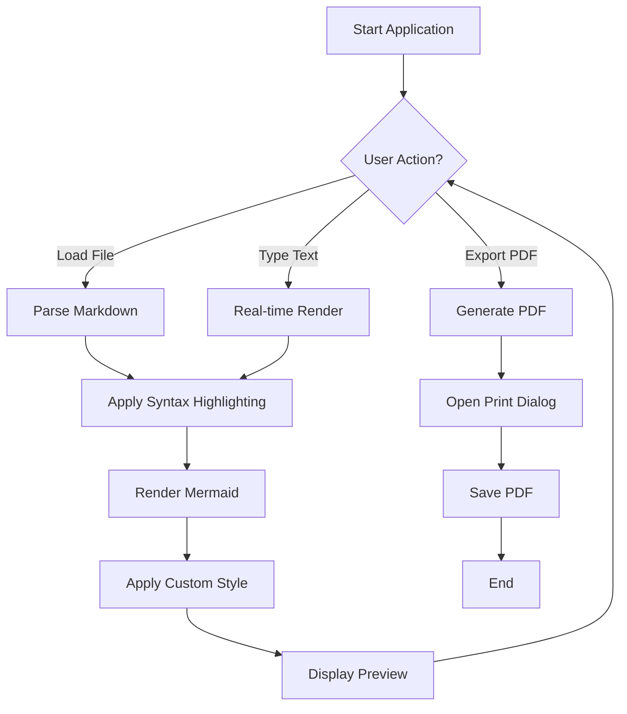
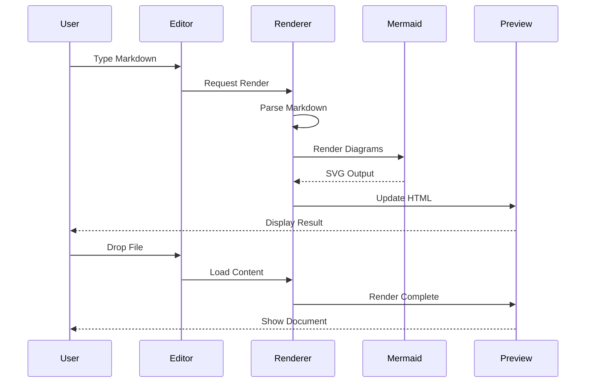
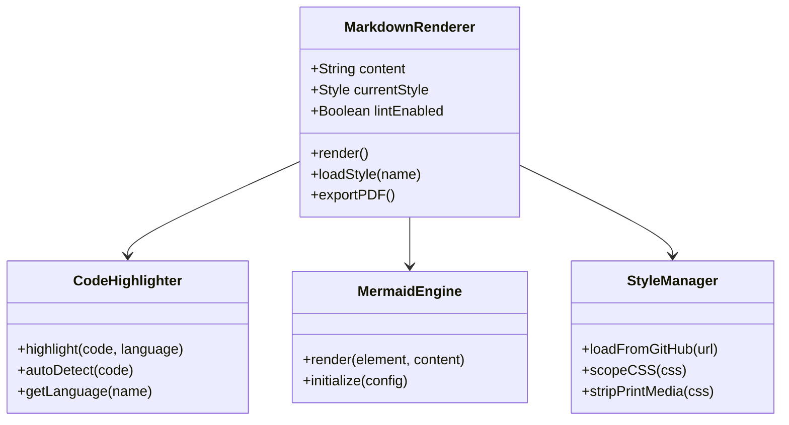
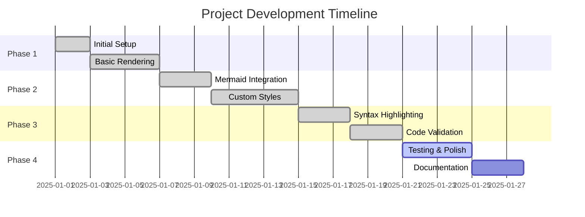
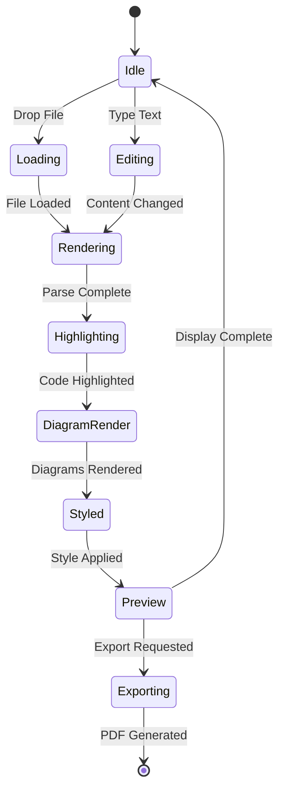

# Comprehensive Markdown + Mermaid Feature Demo

Welcome to the **Markdown Mermaid Renderer** demonstration document! This file showcases all the features including syntax highlighting, Mermaid diagrams, tables, and various formatting options.

## Table of Contents

1. [Text Formatting](#text-formatting)
2. [Lists](#lists)
3. [Code Blocks](#code-blocks)
4. [Tables](#tables)
5. [Mermaid Diagrams](#mermaid-diagrams)
6. [Blockquotes](#blockquotes)

---

## Text Formatting

You can use **bold text**, *italic text*, ***bold and italic***, ~~strikethrough~~, and `inline code`.

Here's a paragraph with some [links to external resources](https://github.com). Links are automatically styled according to your selected theme.

### Subheadings Work Too

And they render beautifully with the custom styles applied!

---

## Lists

### Unordered Lists

- First item
- Second item
  - Nested item 1
  - Nested item 2
- Third item
- Fourth item with **bold** and *italic*

### Ordered Lists

1. Step one: Install the renderer
2. Step two: Open the HTML file
3. Step three: Start writing Markdown
   1. Sub-step A
   2. Sub-step B
4. Step four: Export to PDF

### Task Lists

- [x] Completed task
- [x] Another completed task
- [ ] Pending task
- [ ] Another pending task

---

## Code Blocks

### JavaScript (labeled)

```javascript
function fibonacci(n) {
    if (n <= 1) return n;
    return fibonacci(n - 1) + fibonacci(n - 2);
}

// Calculate the 10th Fibonacci number
const result = fibonacci(10);
console.log(`Fibonacci(10) = ${result}`);

// Arrow function example
const greet = (name) => `Hello, ${name}!`;
```

### Python (labeled)

```python
def quick_sort(arr):
    """Quick sort algorithm implementation"""
    if len(arr) <= 1:
        return arr

    pivot = arr[len(arr) // 2]
    left = [x for x in arr if x < pivot]
    middle = [x for x in arr if x == pivot]
    right = [x for x in arr if x > pivot]

    return quick_sort(left) + middle + quick_sort(right)

# Example usage
numbers = [3, 6, 8, 10, 1, 2, 1]
sorted_numbers = quick_sort(numbers)
print(f"Sorted: {sorted_numbers}")
```

### YAML Configuration (labeled)

```yaml
# Application Configuration
application:
  name: "Markdown Renderer"
  version: "1.0.0"
  author:
    name: "Development Team"
    email: "team@example.com"

server:
  host: "localhost"
  port: 8080
  ssl:
    enabled: true
    certificate: "/path/to/cert.pem"

features:
  - syntax-highlighting
  - mermaid-diagrams
  - pdf-export
  - custom-themes

themes:
  default: "Academia"
  available:
    - name: "GitHub"
      type: "technical"
    - name: "Torpedo"
      type: "creative"
```

### JSON Data (labeled)

```json
{
  "project": {
    "name": "Markdown Mermaid Renderer",
    "version": "1.0.0",
    "description": "A beautiful Markdown renderer with Mermaid support",
    "features": [
      "Real-time rendering",
      "Syntax highlighting",
      "37 professional themes",
      "PDF export"
    ],
    "config": {
      "autoSave": true,
      "theme": "Academia",
      "lintEnabled": false
    },
    "stats": {
      "lines": 1247,
      "size": "45KB",
      "lastModified": "2025-01-21T11:55:00Z"
    }
  }
}
```

### HTML (labeled)

```html
<!DOCTYPE html>
<html lang="en">
<head>
    <meta charset="UTF-8">
    <meta name="viewport" content="width=device-width, initial-scale=1.0">
    <title>Sample Page</title>
</head>
<body>
    <header>
        <h1>Welcome to My Website</h1>
        <nav>
            <a href="#home">Home</a>
            <a href="#about">About</a>
            <a href="#contact">Contact</a>
        </nav>
    </header>
    <main>
        <article>
            <h2>Article Title</h2>
            <p>This is a sample paragraph with <strong>bold</strong> and <em>italic</em> text.</p>
        </article>
    </main>
</body>
</html>
```

### CSS Styles (labeled)

```css
/* Modern Card Component */
.card {
    background: linear-gradient(135deg, #667eea 0%, #764ba2 100%);
    border-radius: 12px;
    box-shadow: 0 10px 20px rgba(0, 0, 0, 0.2);
    padding: 24px;
    transition: transform 0.3s ease;
}

.card:hover {
    transform: translateY(-5px);
    box-shadow: 0 15px 30px rgba(0, 0, 0, 0.3);
}

.card-title {
    font-size: 24px;
    font-weight: 700;
    color: white;
    margin-bottom: 16px;
}
```

### Bash Script (labeled)

```bash
#!/bin/bash

# Deployment script for the application
PROJECT_NAME="markdown-renderer"
DEPLOY_DIR="/var/www/$PROJECT_NAME"

echo "Starting deployment of $PROJECT_NAME..."

# Create backup
BACKUP_DIR="$DEPLOY_DIR/backups/$(date +%Y%m%d_%H%M%S)"
mkdir -p "$BACKUP_DIR"
cp -r "$DEPLOY_DIR/current" "$BACKUP_DIR"

# Deploy new version
git pull origin main
npm install --production
npm run build

echo "Deployment completed successfully!"
```

### Code Without Language Label (unlabeled)

```
This is a code block without a language label.
It will use auto-detection or render as plain text.

function example() {
    return "No syntax highlighting specified";
}

The renderer will still format it nicely!
```

### Another Unlabeled Block

```
# Could be a config file
# Could be a script
# Could be anything!

key1=value1
key2=value2

The auto-detection will try to guess the language.
```

---

## Tables

### Basic Table

| Feature | Status | Priority |
|---------|--------|----------|
| Markdown Rendering | ✅ Complete | High |
| Mermaid Diagrams | ✅ Complete | High |
| Syntax Highlighting | ✅ Complete | High |
| PDF Export | ✅ Complete | Medium |
| Code Validation | ✅ Complete | Low |

### Complex Table with Formatting

| Language | Extension | Highlighting | Validation | Notes |
|----------|-----------|--------------|------------|-------|
| **JavaScript** | `.js` | ✅ Yes | ✅ Syntax Check | Most popular |
| **Python** | `.py` | ✅ Yes | ❌ No | Coming soon |
| **YAML** | `.yaml`, `.yml` | ✅ Yes | ❌ No | Config files |
| **JSON** | `.json` | ✅ Yes | ✅ Parse Check | Data format |
| **HTML** | `.html` | ✅ Yes | ⚠️ Basic | Web markup |
| **CSS** | `.css` | ✅ Yes | ⚠️ Basic | Styling |

### Alignment Example

| Left Aligned | Center Aligned | Right Aligned |
|:-------------|:--------------:|--------------:|
| Text         | Text           | Text          |
| More text    | More text      | More text     |
| Even more    | Even more      | Even more     |

---

## Mermaid Diagrams

### Flowchart



### Sequence Diagram



### Class Diagram



### Gantt Chart



### State Diagram



### Entity Relationship Diagram

```mermaid
erDiagram
    USER ||--o{ DOCUMENT : creates
    USER ||--o{ STYLE : selects
    DOCUMENT ||--|{ CODE_BLOCK : contains
    DOCUMENT ||--|{ DIAGRAM : contains
    DOCUMENT ||--o{ VALIDATION : has
    CODE_BLOCK ||--o{ ISSUE : reports

    USER {
        string name
        string email
        date lastActive
    }

    DOCUMENT {
        string id
        string content
        date created
        date modified
    }

    CODE_BLOCK {
        string language
        string code
        int lineNumber
    }

    DIAGRAM {
        string type
        string definition
        string svg
    }
```

---

## Blockquotes

> **Note:** This is a blockquote. It's perfect for highlighting important information or quotes.

> You can have multiple paragraphs in a blockquote.
>
> Like this one! The styling is applied based on your selected theme.

> ### You can even have headers in blockquotes
>
> And other formatting like **bold**, *italic*, and `code`.

---

## Special Features Demo

### Nested Formatting

This paragraph has **bold text with *nested italic* inside**, and here's `inline code with **bold**` text.

### Horizontal Rules

Three ways to create horizontal rules:

---

***

___

All work perfectly!

### Escape Characters

You can escape special characters: \* \_ \` \# \- \+ \! \[ \] \( \)

---

## Tips for Using This Renderer

1. **Choose Your Style**: Select from 37 professional themes in the dropdown
2. **Real-time Preview**: The preview updates as you type
3. **Drag & Drop**: Drop any `.md` file to load it instantly
4. **Resize Panels**: Drag the handle between editor and preview to adjust sizes
5. **Export Options**:
   - Use **Save as PDF** to export your document (Cmd/Ctrl+P)
6. **Code Validation**: Toggle the validation panel to check your code blocks
7. **Keyboard Shortcuts**:
   - `Cmd/Ctrl + S` - Show save status
   - `Cmd/Ctrl + P` - Print/PDF

---

## Conclusion

This document demonstrates all the features of the Markdown Mermaid Renderer:

✅ Beautiful syntax highlighting for 40+ languages
✅ Professional Mermaid diagrams
✅ Rich table formatting
✅ Custom theme support
✅ PDF export with preserved colors
✅ Code validation for common languages
✅ Resizable editor/preview panels

**Happy documenting!** 📝
