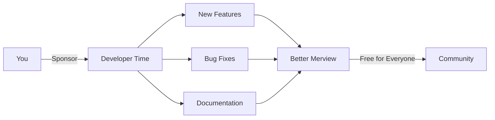

# Support Merview

[← Back to Welcome](/?sample)

---

Merview is free and open source, built with love and maintained in spare time. If you find it useful, consider supporting its continued development!

---

## Why Sponsor?

### Keep It Free

Sponsorship helps ensure Merview stays:

- **Free to use** - No paywalls, no premium tiers
- **Open source** - AGPL-3.0 licensed forever
- **Ad-free** - No tracking, no monetization schemes
- **Independent** - No corporate influence

### Fund Development

Your support enables:

| Priority | Examples |
|----------|----------|
| **Features** | New diagram types, mobile support, collaboration |
| **Maintenance** | Dependency updates, security patches, bug fixes |
| **Infrastructure** | Domain costs, CDN, testing services |
| **Documentation** | Guides, tutorials, examples |

---

## How to Sponsor

### GitHub Sponsors

The easiest way to support Merview:

**[Sponsor @mickdarling on GitHub](https://github.com/sponsors/mickdarling)**

GitHub Sponsors offers:
- One-time or monthly contributions
- GitHub matches some contributions
- Shows your support publicly (optional)
- Simple, secure payment

---

## Other Ways to Help

Not able to sponsor financially? You can still help!

### Spread the Word

- **Star the repo** - [github.com/mickdarling/merview](https://github.com/mickdarling/merview)
- **Share on social** - Tell others about Merview
- **Write about it** - Blog posts, tutorials, mentions

### Contribute

- **Report bugs** - Help us find and fix issues
- **Suggest features** - Share your ideas
- **Submit PRs** - Code contributions welcome
- **Improve docs** - Fix typos, clarify explanations

### Use It!

The best support is simply using Merview for your work. Every user validates the project's purpose.

---

## About the Developer

Hi! I'm **Mick Darling**. I've spent nearly two decades in tech across media, biotech, and IT. I hold four patents in natural language processing and believe deeply in open source.

Merview started as a tool I built to help with [DollhouseMCP](https://github.com/mickdarling/DollhouseMCP), an MCP server for managing AI personas and skills. I needed a better way to write and preview documentation with embedded Mermaid diagrams, so I built this. It turned out to be genuinely useful, so I'm sharing it.

Your sponsorship helps me dedicate more time to open source projects like this.

---

## Sponsors

*Want to see your name here? [Become a sponsor!](https://github.com/sponsors/mickdarling)*

---

## Questions?

- **GitHub**: [@mickdarling](https://github.com/mickdarling)
- **Project Issues**: [github.com/mickdarling/merview/issues](https://github.com/mickdarling/merview/issues)

---

## Navigation

- [← Back to Welcome](/?sample)
- [About Merview](/?url=docs/about.md)
- [Theme Guide](/?url=docs/themes.md)
- [Security](/?url=docs/security.md)
- [Contributing](/?url=docs/contributing.md)
