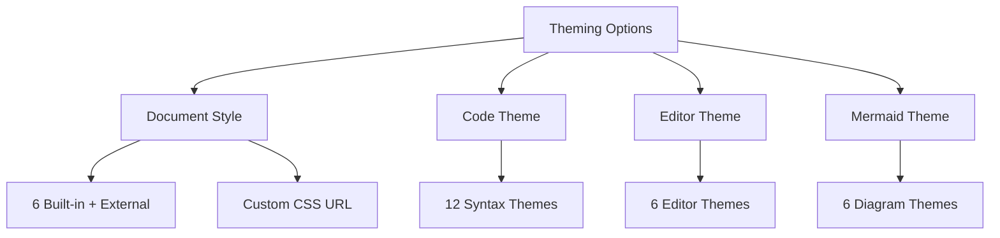
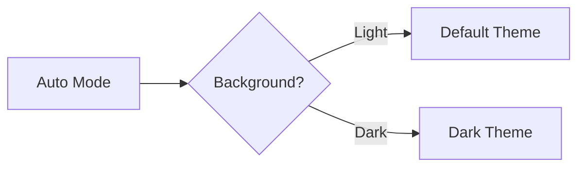

# Theme Guide

[← Back to Welcome](/?sample)

---

Merview offers extensive theming options to make your documents look exactly how you want them. There are four types of themes you can customize:



---

## Document Styles

The **Style** dropdown controls the overall look of your rendered document.

### Built-in Styles

| Style | Best For |
|-------|----------|
| **Clean** | General purpose, minimal design (default) |
| **Academic** | Research papers, formal documents |
| **GitHub** | README files, developer docs |
| **Dark Mode** | Low-light environments |
| **Monospace** | Technical documentation |
| **Newspaper** | Print-style articles |

### External Styles (MarkedCustomStyles)

The Style dropdown provides access to the [MarkedCustomStyles](https://github.com/ttscoff/MarkedCustomStyles) repository, which contains 40+ additional themes. Select "MarkedCustomStyles (external)" from the dropdown to browse themes including:

- Academia, Avenue, Bear, Torpedo
- Swiss, Ulysses, Yeti, and many more

**Note:** These external styles have no explicit license. See THIRD-PARTY-NOTICES.md for details.

### Using Custom CSS

You can load any CSS file from a URL:

1. Select **"Load from URL..."** in the Style dropdown
2. Enter the URL to your CSS file
3. The style is applied immediately

**Trusted sources for CSS:**
- `raw.githubusercontent.com` - GitHub raw files
- `cdn.jsdelivr.net` - jsDelivr CDN
- `unpkg.com` - unpkg CDN
- `cdnjs.cloudflare.com` - Cloudflare CDN
- `gist.githubusercontent.com` - GitHub Gists

---

## Code Syntax Themes

The **Code Theme** dropdown controls how code blocks in the preview are highlighted:

```javascript
// This code block uses your selected theme
function example() {
    const message = "Hello, World!";
    console.log(message);
    return true;
}
```

### Available Code Themes

| Theme | Style |
|-------|-------|
| **GitHub Dark** | Dark mode GitHub (default) |
| **GitHub Light** | Light, familiar |
| **VS Code Dark+** | Visual Studio dark |
| **Monokai** | Classic dark theme |
| **Atom One Dark** | Atom editor style |
| **Atom One Light** | Light Atom style |
| **Nord** | Arctic, bluish dark |
| **Tokyo Night Dark** | Purple-tinted dark |
| **Tokyo Night Light** | Soft light theme |
| **Night Owl** | Dark blue theme |
| **Obsidian** | Dark gray theme |
| **Agate** | Minimal dark |

---

## Editor Themes

The **Editor Theme** dropdown controls the editing pane (left side) appearance:

| Theme | Style |
|-------|-------|
| **Material Darker** | Dark gray (default) |
| **GitHub Dark** | GitHub's dark theme |
| **Monokai** | Classic dark |
| **Dracula** | Purple-tinted dark |
| **Solarized Dark** | Warm dark theme |
| **Solarized Light** | Warm light theme |

---

## Mermaid Diagram Themes

The **Mermaid Theme** dropdown controls diagram styling:

| Theme | Description |
|-------|-------------|
| **Auto** | Automatically switches between Default and Dark based on your document style's background color (default) |
| **Default** | Blue/gray tones, best for light backgrounds |
| **Forest** | Green-tinted, nature-inspired |
| **Dark** | Dark background, best for dark document styles |
| **Neutral** | Grayscale, minimal distraction |
| **Base** | Minimal styling, useful as starting point for customization |

### Auto Mode

When set to **Auto**, Merview detects whether your document style has a dark or light background and automatically chooses the appropriate Mermaid theme:
- Light backgrounds → Default theme
- Dark backgrounds → Dark theme



---

## Theme Combinations

Here are some recommended combinations:

| Document | Code | Editor | Mermaid | Use Case |
|----------|------|--------|---------|----------|
| Clean | GitHub Dark | Material Darker | Auto | General purpose |
| Academic | GitHub Light | Solarized Light | Neutral | Papers, reports |
| GitHub | GitHub Dark | GitHub Dark | Default | Developer docs |
| Dark Mode | Monokai | Monokai | Dark | Night coding |
| Monospace | VS Code Dark+ | Material Darker | Auto | Technical docs |

---

## Tips

1. **Use Auto for Mermaid** - Let Merview pick the best diagram theme automatically
2. **Match light with light** - Pair light document styles with light code/editor themes
3. **Consistency matters** - Use the same theme family across all settings
4. **Consider your audience** - Academic for formal, creative for portfolios
5. **Test before exporting** - Preview how themes look in PDF

---

## Navigation

- [← Back to Welcome](/?sample)
- [About Merview](/?url=docs/about.md)
- [Security](/?url=docs/security.md)
- [Contributing](/?url=docs/contributing.md)
- [Support the Project](/?url=docs/sponsor.md)
