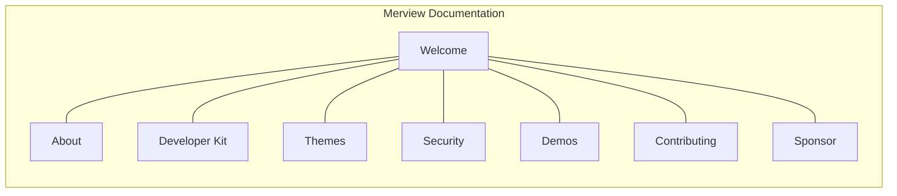
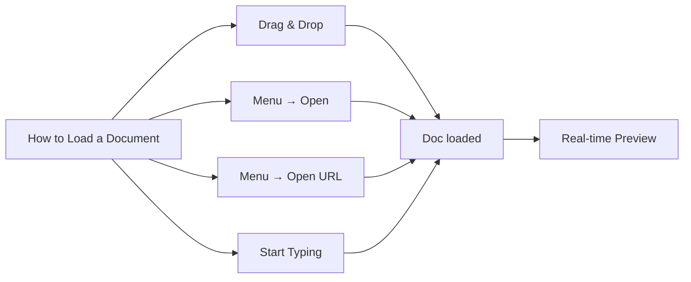

# Welcome to Merview

A client-side Markdown editor with first-class Mermaid diagram support.



---

## Quick Links

- [About Merview](/?url=docs/about.md) - Features, technology, and how it works
- [Developer Kit](/?url=docs/developer-kit.md) - Integration guide and URL patterns
- [Theme Guide](/?url=docs/themes.md) - 37 document styles and customization
- [Security](/?url=docs/security.md) - Privacy-first design and protections
- [Feature Demos](/?url=docs/demos/index.md) - Interactive examples
- [Contributing](/?url=docs/contributing.md) - How to help improve Merview
- [Support the Project](/?url=docs/sponsor.md) - Sponsor development

---

## Getting Started

### 1. Load a Document



Choose how to start: drag and drop a `.md` file onto the editor, use the Menu to open a local file or URL, or simply start typing directly in the editor.

### 2. Write Markdown

```markdown
# Heading 1
## Heading 2

Write **bold text** and *italic text*.

- Bullet lists
- Are easy

1. Numbered lists
2. Work too

[Links](https://example.com) are simple.
```

Type in the left pane. The preview updates in real-time on the right.

### 3. Add Mermaid Diagrams

Use fenced code blocks with `mermaid` as the language:

````markdown

````

Which renders as:


### 4. Choose Your Style

Customize your view with multiple theme options:
- **Style** - Document appearance themes
- **Code Theme** - Syntax highlighting for code blocks
- **Editor Theme** - Editor pane appearance
- **Mermaid Theme** - Diagram styling

See the [Theme Guide](/?url=docs/themes.md) for all options and previews.

### 5. Export

Click **Print/PDF** to save your document.

---

## Feature Showcase

### Code Syntax Highlighting

190+ languages supported with beautiful themes:

```javascript
// JavaScript with syntax highlighting
const greet = (name) => `Hello, ${name}!`;
console.log(greet('World'));
```

```python
# Python example
def fibonacci(n):
    if n <= 1:
        return n
    return fibonacci(n-1) + fibonacci(n-2)
```

### Tables

| Feature | Status |
|---------|--------|
| Markdown Rendering | ✅ |
| Mermaid Diagrams | ✅ |
| Syntax Highlighting | ✅ |
| PDF Export | ✅ |
| 37 Themes | ✅ |
| YAML Front Matter | ✅ |
| Code Validation | ✅ |
| Load from URL | ✅ |
| International Text | ✅ |

### Flowcharts


### Sequence Diagrams


### Class Diagrams


---

## Tips

1. **AI-Powered Content** - AI assistants (ChatGPT, Claude, etc.) excel at generating markdown with Mermaid diagrams and code blocks—great for visualizing complex topics
2. **Load from URL** - Use `?url=` parameter or the Open URL dialog
3. **YAML Metadata** - Add `---` delimited YAML at the start for document info
4. **Code Validation** - Toggle the Lint button to check JSON, HTML, CSS
5. **Keyboard Shortcuts** - Ctrl+S to save, Ctrl+P to print
6. **Auto-save** - Your work is saved to browser storage

---

## Open Source

Merview is free and open source under the AGPL-3.0 license.

- **GitHub**: [github.com/mickdarling/merview](https://github.com/mickdarling/merview)
- **Issues**: [Report a bug or request a feature](https://github.com/mickdarling/merview/issues)

---

**Start writing!** Clear this document and create something amazing.
